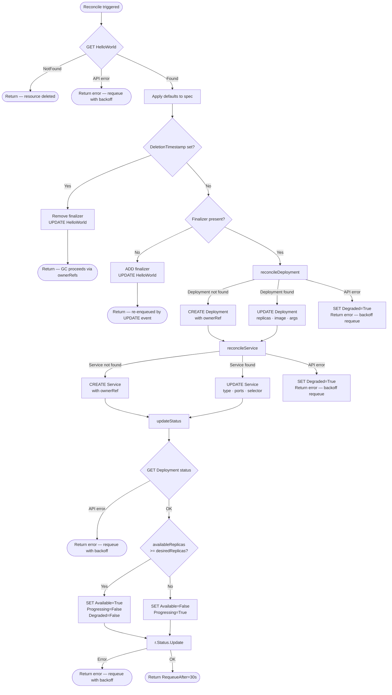

# hello-operator — Architecture Document

> **Module:** `github.com/example/hello-operator`  
> **Framework:** `sigs.k8s.io/controller-runtime v0.16.3`  
> **Kubernetes API:** `k8s.io/api v0.28.4` · `k8s.io/apimachinery v0.28.4` · `k8s.io/client-go v0.28.4`  
> **Go Version:** 1.21+  
> **Date:** September 2026

---

## Table of Contents

1. [Overview and Purpose](#1-overview-and-purpose)
2. [Repository and Package Structure](#2-repository-and-package-structure)
3. [Custom Resource Definition (CRD) Design](#3-custom-resource-definition-crd-design)
4. [Operator Lifecycle Management](#4-operator-lifecycle-management)
5. [Reconciliation State Machine](#5-reconciliation-state-machine)
6. [RBAC and Security Model](#6-rbac-and-security-model)
7. [Leader Election and High Availability](#7-leader-election-and-high-availability)
8. [Health Probes and Metrics](#8-health-probes-and-metrics)
9. [Configuration and Tunables](#9-configuration-and-tunables)
10. [Deployment Topology](#10-deployment-topology)
11. [Extension Points](#11-extension-points)
12. [Glossary](#12-glossary)

---

## 1. Overview and Purpose

### 1.1 What the Operator Does

`hello-operator` is a Kubernetes Operator that manages the full lifecycle of a "Hello World" HTTP service through a first-class Kubernetes API. Users declare the desired state of their application in a `HelloWorld` custom resource; the operator continuously reconciles cluster state to match that declaration.

For each `HelloWorld` object the operator:

1. Creates and owns a `Deployment` running a configurable HTTP echo container.
2. Creates and owns a `Service` that exposes the Deployment's pods.
3. Synchronises `spec` changes (replica count, message, image, port, service type) to the owned resources.
4. Reports the observed state back through structured `Status.Conditions`.
5. Cleans up all owned resources when the `HelloWorld` object is deleted.

### 1.2 The Problem It Solves

Deploying an application on Kubernetes requires knowledge of at least three resource types (Deployment, Service, ConfigMap), their interconnection, and their lifecycle coordination. `hello-operator` encapsulates this operational knowledge into a single abstraction:

```yaml
apiVersion: apps.example.com/v1alpha1
kind: HelloWorld
metadata:
  name: my-app
spec:
  replicas: 3
  message: "Hello from production!"
  serviceType: LoadBalancer
```

This one resource replaces a Deployment YAML, a Service YAML, and all the manual coordination between them. It is a demonstration of the **Operator Pattern**: encoding domain-specific operational knowledge as a controller that speaks the Kubernetes API.

### 1.3 Position in the Kubernetes Extension Model

Kubernetes is extended through three official mechanisms:

| Mechanism | Used by hello-operator |
|---|---|
| **Custom Resource Definitions (CRD)** | Defines the `HelloWorld` API type |
| **Custom Controllers** | Implements the reconciliation loop |
| **Admission Webhooks** | Not used (future extension point) |

The operator plugs into this model by registering a CRD with the API server and running a controller loop that watches `HelloWorld`, `Deployment`, and `Service` objects via the `controller-runtime` informer/cache layer.

### 1.4 Framework: controller-runtime

`sigs.k8s.io/controller-runtime` is the canonical Go library for building Kubernetes operators. It provides:

- A **Manager** that owns the shared informer cache and runs all controllers.
- A **Reconciler** interface (`Reconcile(ctx, Request) (Result, error)`) that every controller implements.
- **Builder** helpers (`ctrl.NewControllerManagedBy`) for declarative controller wiring.
- **Client** that reads from the in-memory cache (fast) and writes directly to the API server.
- Built-in **leader election**, **health probes**, and **metrics** servers.

---

## 2. Repository and Package Structure

### 2.1 Annotated Directory Tree

```
hello-operator/
│
├── api/                        ← Public API types (versioned)
│   └── v1alpha1/
│       ├── doc.go              ← Package declaration + groupName annotation
│       ├── groupversion_info.go← GroupVersion constant, SchemeBuilder, AddToScheme
│       ├── helloworld_types.go ← HelloWorldSpec, HelloWorldStatus, condition types
│       └── zz_generated.deepcopy.go ← DeepCopy implementations (generated)
│
├── cmd/
│   └── manager/
│       └── main.go             ← Binary entry point; wires Manager + controllers
│
├── config/                     ← Kubernetes manifests (Kustomize-based)
│   ├── crd/
│   │   ├── bases/
│   │   │   └── apps.example.com_helloworlds.yaml  ← Full CRD manifest
│   │   └── kustomization.yaml
│   ├── default/
│   │   └── kustomization.yaml  ← Top-level overlay; sets image, namespace
│   ├── manager/
│   │   ├── manager.yaml        ← Operator Deployment
│   │   ├── namespace.yaml      ← hello-operator-system Namespace
│   │   └── kustomization.yaml
│   ├── rbac/
│   │   ├── role.yaml           ← ClusterRole rules
│   │   ├── role_binding.yaml   ← ClusterRoleBinding
│   │   ├── service_account.yaml← Operator ServiceAccount
│   │   └── kustomization.yaml
│   └── samples/
│       ├── apps_v1alpha1_helloworld.yaml ← Example HelloWorld CR
│       └── kustomization.yaml
│
├── docs/
│   ├── quickstart.md           ← Step-by-step deployment guide
│   └── quickstart.html         ← Self-contained HTML version
│
├── hack/
│   └── boilerplate.go.txt      ← License header template for generated code
│
├── internal/
│   └── controller/
│       └── helloworld_controller.go ← HelloWorldReconciler + all reconcile helpers
│
├── Dockerfile                  ← Multi-stage builder (alpine) + runtime (distroless)
├── Makefile                    ← build, generate, manifests, deploy, undeploy targets
├── go.mod                      ← Module definition + direct dependencies
└── go.sum                      ← Cryptographic checksums for all dependencies
```

### 2.2 Package Responsibilities

#### `api/v1alpha1` — Public API

This package is the **stable interface boundary** of the operator. It contains only type definitions and the scheme registration; it contains no business logic. Any consumer (tests, external tooling, `kubectl`) that imports operator types depends only on this package.

Key exports:
- `HelloWorld` — the CRD Go type
- `HelloWorldSpec` / `HelloWorldStatus` — the spec and status structs
- `ConditionType` constants (`Available`, `Progressing`, `Degraded`)
- `ServiceType` enumeration (`ClusterIP`, `NodePort`, `LoadBalancer`)
- `GroupVersion` — the `schema.GroupVersion` used everywhere
- `AddToScheme` — the function passed to `runtime.NewScheme()` in `main.go`

The package is versioned in its path (`v1alpha1`). When a breaking API change is needed, a new `v1beta1` or `v1` package is added alongside without removing `v1alpha1`.

#### `internal/controller` — Business Logic

This package contains all reconciliation logic. It is in `internal/` because it is an implementation detail — nothing outside the module should import it directly. The single file [`helloworld_controller.go`](../internal/controller/helloworld_controller.go) contains:

- `HelloWorldReconciler` struct (implements `reconcile.Reconciler`)
- `Reconcile()` — the main entry point called by the framework
- `reconcileDeployment()` — idempotent create/update of the Deployment
- `reconcileService()` — idempotent create/update of the Service
- `updateStatus()` — reads Deployment status and writes conditions
- `handleDeletion()` / `addFinalizer()` — finalizer lifecycle
- `applyDefaults()` — fills zero-value spec fields
- `SetupWithManager()` — controller wiring

#### `cmd/manager` — Binary Entry Point

This package is the `main` package. It owns the process lifecycle: parse flags, create the runtime scheme, construct the Manager, register the controller, add health checks, and call `mgr.Start()`. It contains no business logic — it is purely wiring.

#### `config/` — Manifests

Not Go code. All Kubernetes YAML organized into Kustomize bases and overlays. The directory hierarchy mirrors the [Kubebuilder project layout](https://book.kubebuilder.io/reference/project-config.html) convention that tooling (`controller-gen`, `kustomize`, `make`) expects.

### 2.3 Dependency Graph

```
cmd/manager
    │
    ├── imports api/v1alpha1         (scheme registration, type references)
    ├── imports internal/controller  (controller registration)
    └── imports controller-runtime   (Manager, ctrl.GetConfigOrDie)

internal/controller
    │
    ├── imports api/v1alpha1         (HelloWorld types)
    ├── imports k8s.io/api           (Deployment, Service, Pod types)
    ├── imports k8s.io/apimachinery  (ObjectMeta, Condition, GVK)
    └── imports controller-runtime   (Client, Reconciler, Builder, controllerutil)

api/v1alpha1
    │
    └── imports k8s.io/apimachinery  (TypeMeta, ObjectMeta, Condition)
```

There are **no circular imports**. `api/v1alpha1` is a leaf. `internal/controller` depends on `api/v1alpha1` but not on `cmd/`. `cmd/` depends on both.

---

## 3. Custom Resource Definition (CRD) Design

### 3.1 Group, Version, Kind (GVK)

| Field | Value | Rationale |
|---|---|---|
| **Group** | `apps.example.com` | Namespaced under `example.com` to avoid conflicts with built-in `apps` group |
| **Version** | `v1alpha1` | First iteration; not yet stable; breaking changes are allowed |
| **Kind** | `HelloWorld` | PascalCase singular noun naming the resource |
| **Plural** | `helloworlds` | Auto-derived lowercase plural |
| **Short name** | `hw` | Used with `kubectl get hw` |
| **Scope** | `Namespaced` | Resources exist within a namespace, not cluster-wide |
| **Category** | `all` | Appears in `kubectl get all` output |

The fully qualified API version string is `apps.example.com/v1alpha1`.

### 3.2 Scheme Registration

Registration is the process of telling the Go runtime's `runtime.Scheme` how to map GVK strings to Go structs, enabling the client to serialise and deserialise objects.

**Step 1 — `groupversion_info.go` declares the scheme builder:**

```go
var (
    GroupVersion  = schema.GroupVersion{Group: "apps.example.com", Version: "v1alpha1"}
    SchemeBuilder = &scheme.Builder{GroupVersion: GroupVersion}
    AddToScheme   = SchemeBuilder.AddToScheme
)
```

**Step 2 — `helloworld_types.go` registers the types:**

```go
func init() {
    SchemeBuilder.Register(&HelloWorld{}, &HelloWorldList{})
}
```

**Step 3 — `main.go` adds `HelloWorld` types and all standard k8s types to the shared scheme:**

```go
utilruntime.Must(clientgoscheme.AddToScheme(scheme))   // core, apps, etc.
utilruntime.Must(appsv1alpha1.AddToScheme(scheme))     // HelloWorld, HelloWorldList
utilruntime.Must(appsv1.AddToScheme(scheme))           // Deployment
utilruntime.Must(corev1.AddToScheme(scheme))           // Service, Pod
```

The shared `scheme` is passed to `ctrl.NewManager`, making it available to the client and all informers.

### 3.3 `HelloWorldSpec` Fields

`HelloWorldSpec` encodes the **desired state** declared by the user.

| Field | Type | Default | Validation | Description |
|---|---|---|---|---|
| `replicas` | `*int32` | `1` | min 0, max 10 | Desired number of pod replicas. Pointer type so `nil` can be distinguished from `0`. |
| `message` | `string` | `"Hello, World!"` | — | Text the HTTP server returns in its response body. Passed as `-text=<message>` to `hashicorp/http-echo`. |
| `image` | `string` | `"hashicorp/http-echo:latest"` | — | Container image to run. Must be pullable from the cluster's nodes. |
| `port` | `int32` | `5678` | min 1, max 65535 | Container port number. Must match the port the image listens on. |
| `serviceType` | `ServiceType` | `"ClusterIP"` | enum: ClusterIP, NodePort, LoadBalancer | How to expose the Service externally. |

All fields are marked `+optional` and carry `+kubebuilder:default` markers. This means a `HelloWorld` resource with an empty spec is valid and will use all defaults.

**Why `*int32` for Replicas?**

Using a pointer for `replicas` lets the operator distinguish between a user who explicitly set `replicas: 0` (scale to zero) and a user who omitted the field entirely (use default). An unset `int32` would be indistinguishable from zero.

### 3.4 `HelloWorldStatus` Fields

`HelloWorldStatus` encodes the **observed state** reported by the controller. Users must not write to status fields directly; the status subresource is separated from the main resource to prevent spec/status conflicts.

| Field | Type | Description |
|---|---|---|
| `conditions` | `[]metav1.Condition` | Structured condition list following the Kubernetes API conventions. |
| `readyReplicas` | `int32` | Number of pods with all containers passing their readiness probes. Sourced from `Deployment.Status.ReadyReplicas`. |
| `availableReplicas` | `int32` | Number of pods available for at least `minReadySeconds`. Sourced from `Deployment.Status.AvailableReplicas`. |
| `observedGeneration` | `int64` | The `metadata.generation` of the HelloWorld object that was last successfully reconciled. Allows consumers to detect stale status. |

### 3.5 Condition Types

Conditions follow the [Kubernetes API conventions for conditions](https://github.com/kubernetes/community/blob/master/contributors/devel/sig-architecture/api-conventions.md#typical-status-properties). Each condition is an entry in `status.conditions` with fields `type`, `status`, `reason`, `message`, `lastTransitionTime`, and `observedGeneration`.

| Condition Type | Meaning |
|---|---|
| `Available` | `True` when `availableReplicas >= desiredReplicas`. The application is fully serving traffic. |
| `Progressing` | `True` when a rollout is in progress (replicas not yet reached, update ongoing). `False` when stable. |
| `Degraded` | `True` when a reconciliation error occurred (Deployment creation failed, Service failed, etc.). `False` when healthy. |

**Condition Invariants:**
- Exactly one of `Available=True` or `Progressing=True` holds at steady state.
- `Degraded=True` is orthogonal — it can coexist with `Progressing=True`.
- All three conditions are always present in the list (set to `False` with an appropriate reason when not active). This makes automated tooling simpler, as it can always `GET` a condition by type.

### 3.6 Printer Columns

The `+kubebuilder:printcolumn` markers generate the `additionalPrinterColumns` block in the CRD YAML, controlling what `kubectl get helloworld` displays:

```
NAMESPACE   NAME                 REPLICAS   READY   MESSAGE                 AGE
default     helloworld-sample    2          2       Hello from hello-op!    5m
```

| Column | JSONPath | Source |
|---|---|---|
| Replicas | `.spec.replicas` | Spec |
| Ready | `.status.readyReplicas` | Status |
| Message | `.spec.message` | Spec |
| Age | `.metadata.creationTimestamp` | Metadata |

### 3.7 Status Subresource

The `+kubebuilder:subresource:status` marker causes `controller-gen` to add the `subresources.status: {}` block to the CRD. This has two effects:

1. The `status` field is managed under a separate `/status` endpoint in the API server.
2. A `kubectl apply` that includes a `status` block is silently stripped — only the controller may update status via `r.Status().Update(ctx, obj)`.

This separation is critical: it prevents a race condition where a user's `kubectl apply` could overwrite the controller's status update.

---

## 4. Operator Lifecycle Management

### 4.1 Startup and Manager Initialization

The `main()` function in [`cmd/manager/main.go`](../cmd/manager/main.go) performs the following startup sequence:

```
main()
  │
  ├── 1. Register types with the shared runtime.Scheme
  │        clientgoscheme (core k8s types)
  │        appsv1alpha1 (HelloWorld)
  │        appsv1 (Deployment)
  │        corev1 (Service)
  │
  ├── 2. Parse CLI flags
  │        --metrics-bind-address=:8080
  │        --health-probe-bind-address=:8081
  │        --leader-elect
  │        --leader-election-id=hello-operator-leader-election
  │        zap logger flags (--zap-log-level, --zap-encoder, etc.)
  │
  ├── 3. ctrl.NewManager(ctrl.GetConfigOrDie(), ctrl.Options{...})
  │        Reads kubeconfig (in-cluster ServiceAccount or KUBECONFIG env var)
  │        Creates the shared informer cache
  │        Starts the metrics server (:8080)
  │        Starts the health probe server (:8081)
  │        Configures leader election if --leader-elect is set
  │
  ├── 4. HelloWorldReconciler{}.SetupWithManager(mgr)
  │        Registers the reconciler
  │        Adds watches for HelloWorld, Deployment, Service
  │
  ├── 5. mgr.AddHealthzCheck("healthz", healthz.Ping)
  │        Registers GET /healthz → 200 OK
  │
  ├── 6. mgr.AddReadyzCheck("readyz", healthz.Ping)
  │        Registers GET /readyz → 200 OK
  │
  └── 7. mgr.Start(ctrl.SetupSignalHandler())
           Starts all informers (cache warm-up)
           Starts all registered controllers
           Blocks until SIGTERM or SIGINT
```

`ctrl.GetConfigOrDie()` attempts to load the cluster configuration in this order:

1. `KUBECONFIG` environment variable.
2. `~/.kube/config` file.
3. In-cluster service account token at `/var/run/secrets/kubernetes.io/serviceaccount/`.

### 4.2 Controller Registration and `SetupWithManager`

```go
func (r *HelloWorldReconciler) SetupWithManager(mgr ctrl.Manager) error {
    return ctrl.NewControllerManagedBy(mgr).
        For(&appsv1alpha1.HelloWorld{}).
        Owns(&appsv1.Deployment{}).
        Owns(&corev1.Service{}).
        Complete(r)
}
```

`ctrl.NewControllerManagedBy` is a **builder** that:

1. **`For(&HelloWorld{})`** — registers a watch on `HelloWorld` objects. Any create/update/delete event on a `HelloWorld` enqueues its `NamespacedName` onto the work queue.

2. **`Owns(&Deployment{})`** — registers a watch on `Deployment` objects. When a Deployment whose `ownerReferences` points to a `HelloWorld` changes (e.g., a pod crashes, a rollout completes), the owning `HelloWorld`'s `NamespacedName` is enqueued. This is how the operator detects that the actual state has diverged from the desired state without polling.

3. **`Owns(&Service{})`** — same as above for Services.

4. **`Complete(r)`** — finalises the builder, wires everything up, and returns the built controller.

The resulting controller has:
- A dedicated goroutine watching the work queue.
- A default rate limiter (exponential backoff: 5ms → 1000s, max 100 items in flight).
- A default maximum of 1 concurrent reconcile (configurable, see Section 9).

### 4.3 Informer and Cache Warm-Up

Before any reconciler runs, `mgr.Start()` starts all informers and waits for their caches to sync. During cache warm-up:

1. Each informer performs a **List** of its resource type from the API server.
2. It populates the in-memory cache (a thread-safe `store.Store` backed by a Go `map`).
3. It starts a **Watch** connection to receive future events as a stream of `ADDED`, `MODIFIED`, and `DELETED` notifications.
4. The Manager blocks controller start until all caches report `HasSynced() == true`.

This warm-up ensures that `r.Get()` and `r.List()` calls inside `Reconcile()` always read from a consistent, populated cache rather than hitting the API server on every call.

**Performance implication:** All reads inside `Reconcile()` are served from the in-memory cache (O(1), no network). Only writes (`r.Create`, `r.Update`, `r.Status().Update`) go to the API server.

### 4.4 The Reconciliation Loop

`Reconcile(ctx context.Context, req ctrl.Request)` is called by the framework whenever a watched object changes. `req` contains only the `NamespacedName` of the changed object — not the object itself. The reconciler fetches the current state fresh from the cache on every call.

#### Entry and Step-by-Step Execution

```
Reconcile(ctx, req{Namespace: "default", Name: "helloworld-sample"})
│
├── 1. GET HelloWorld "default/helloworld-sample" from cache
│       → NotFound: return {}, nil  (deleted before reconcile ran; normal)
│       → Error:    return {}, err  (requeued with backoff)
│       → Found:    continue
│
├── 2. applyDefaults(hw)
│       Fill nil Replicas → 1
│       Fill empty Message → "Hello, World!"
│       Fill empty Image → "hashicorp/http-echo:latest"
│       Fill zero Port → 5678
│       Fill empty ServiceType → "ClusterIP"
│       (No API call; local mutation only)
│
├── 3. Deletion check: hw.DeletionTimestamp != nil?
│       YES → handleDeletion()
│               Remove finalizer "apps.example.com/finalizer"
│               UPDATE HelloWorld (triggers garbage collection of owned resources)
│               return {}, nil
│       NO  → continue
│
├── 4. Finalizer check: contains "apps.example.com/finalizer"?
│       NO  → addFinalizer()
│               UPDATE HelloWorld to add finalizer
│               return {}, nil  (requeue immediately; update triggers a new reconcile)
│       YES → continue
│
├── 5. reconcileDeployment(ctx, hw)
│       Build desired Deployment (replicas, image, args, probes, resources, SCC)
│       SetControllerReference(hw → deployment)
│       GET existing Deployment "{name}-deployment"
│           NotFound → CREATE → return nil
│           Found → UPDATE mutable fields (replicas, image, args, labels)
│       Error → set Degraded=True condition → return err (requeued with backoff)
│
├── 6. reconcileService(ctx, hw)
│       Build desired Service (type, port, selector)
│       SetControllerReference(hw → service)
│       GET existing Service "{name}-service"
│           NotFound → CREATE → return nil
│           Found → UPDATE (type, ports, selector; preserve ClusterIP)
│       Error → set Degraded=True condition → return err (requeued with backoff)
│
├── 7. updateStatus(ctx, hw)
│       GET current Deployment status (ReadyReplicas, AvailableReplicas)
│       Compute: available = AvailableReplicas >= *Replicas
│       Set conditions:
│           available=true:  Available=True, Progressing=False, Degraded=False
│           available=false: Available=False, Progressing=True
│       r.Status().Update(ctx, hw)  ← writes to /status subresource
│
└── 8. return ctrl.Result{RequeueAfter: 30s}, nil
        (Requeue after 30 seconds to detect drift not covered by watches)
```

#### Requeue Logic

| Return value | Behaviour |
|---|---|
| `ctrl.Result{}, nil` | Do not requeue. The next reconcile will be triggered by a watch event. |
| `ctrl.Result{}, err` | Return error to the framework. The work queue applies exponential backoff before re-enqueuing (5ms → 1000s). |
| `ctrl.Result{Requeue: true}, nil` | Requeue immediately without error. Used internally when a finalizer is first added. |
| `ctrl.Result{RequeueAfter: 30*time.Second}, nil` | Requeue after 30 seconds. The steady-state return: periodic drift detection. |

#### Idempotency Guarantees

Every step in `Reconcile()` is designed to be **idempotent** — calling it multiple times with the same inputs produces the same result:

- **`r.Create()` after `NotFound`:** If the resource already exists (created by a concurrent reconcile), the API server returns `AlreadyExists`. This is handled by the `NotFound` branch only; a concurrent create arriving mid-reconcile would cause the `r.Get()` in the same function to succeed on the next invocation.
- **`r.Update()` after `Found`:** Only mutable fields are overwritten. Immutable fields (e.g., `ClusterIP` on a Service) are preserved from `existing`.
- **Owner references:** `controllerutil.SetControllerReference` is idempotent — it only adds if absent.
- **Conditions:** `meta.SetStatusCondition` upserts by `type` — it replaces an existing condition of the same type rather than appending.

### 4.5 Status Patching and Condition Management

Status is always written via the **status subresource** using `r.Status().Update(ctx, hw)`. This sends a `PUT` request to `/apis/apps.example.com/v1alpha1/namespaces/<ns>/helloworlds/<name>/status`. The API server strips the `spec` field from this request, preventing accidental spec overwrites.

`meta.SetStatusCondition` from `k8s.io/apimachinery/pkg/api/meta` performs an **upsert** by condition type:

```go
// Pseudocode of meta.SetStatusCondition:
for i, existing := range conditions {
    if existing.Type == newCondition.Type {
        if existing.Status != newCondition.Status {
            newCondition.LastTransitionTime = now()  // only update time on status change
        } else {
            newCondition.LastTransitionTime = existing.LastTransitionTime  // preserve
        }
        conditions[i] = newCondition
        return
    }
}
conditions = append(conditions, newCondition)  // not found: add
```

`lastTransitionTime` is only updated when the `status` value (`True`/`False`/`Unknown`) actually changes. This prevents spurious time updates on every reconcile.

### 4.6 Graceful Shutdown and Signal Handling

`ctrl.SetupSignalHandler()` returns a `context.Context` that is cancelled when `SIGTERM` or `SIGINT` is received. `mgr.Start(ctx)` honours this context:

1. The Manager stops accepting new reconcile requests.
2. In-flight reconcile calls are allowed to complete (bounded by the context's deadline).
3. All informer goroutines are stopped.
4. The leader election lease is released.
5. `mgr.Start()` returns, and `main()` exits cleanly.

The Deployment manifest sets `terminationGracePeriodSeconds: 10`, giving in-flight reconciles up to 10 seconds to complete before Kubernetes sends `SIGKILL`.

---

## 5. Reconciliation State Machine

The following Mermaid diagram models the reconciler as a finite-state machine. Each node is a decision point or action; edges are labelled with the condition that drives the transition.



### 5.1 State Table

| State | Condition | Next State |
|---|---|---|
| Resource not found | `IsNotFound(err)` on initial GET | Terminal (nil return) |
| Deletion pending | `DeletionTimestamp != zero` | Remove finalizer → terminal |
| Finalizer absent | First encounter of the resource | Add finalizer → re-enqueue |
| Deployment absent | `IsNotFound` on Deployment GET | Create Deployment |
| Deployment present | Deployment GET succeeded | Update Deployment |
| Service absent | `IsNotFound` on Service GET | Create Service |
| Service present | Service GET succeeded | Update Service |
| Deployment fully available | `AvailableReplicas >= desired` | `Available=True`, requeue 30s |
| Deployment rolling out | `AvailableReplicas < desired` | `Available=False`, `Progressing=True`, requeue 30s |
| Any API error | Non-`IsNotFound` error on GET/CREATE/UPDATE | `Degraded=True`, return error, exponential backoff requeue |

---

## 6. RBAC and Security Model

### 6.1 Kubebuilder RBAC Markers

RBAC markers are Go comments on the `Reconcile` function. `controller-gen` reads them and emits the corresponding `ClusterRole` YAML.

```go
// +kubebuilder:rbac:groups=apps.example.com,resources=helloworlds,verbs=get;list;watch;create;update;patch;delete
// +kubebuilder:rbac:groups=apps.example.com,resources=helloworlds/status,verbs=get;update;patch
// +kubebuilder:rbac:groups=apps.example.com,resources=helloworlds/finalizers,verbs=update
// +kubebuilder:rbac:groups=apps,resources=deployments,verbs=get;list;watch;create;update;patch;delete
// +kubebuilder:rbac:groups=core,resources=services,verbs=get;list;watch;create;update;patch;delete
// +kubebuilder:rbac:groups=core,resources=events,verbs=create;patch
```

### 6.2 Resulting ClusterRole Rules

Three `ClusterRole` objects are generated.

#### `hello-operator-manager-role` (operator process)

| API Group | Resources | Verbs | Rationale |
|---|---|---|---|
| `apps.example.com` | `helloworlds` | get, list, watch, create, update, patch, delete | Full lifecycle management of own CRD |
| `apps.example.com` | `helloworlds/status` | get, update, patch | Write status subresource |
| `apps.example.com` | `helloworlds/finalizers` | update | Add/remove finalizer |
| `apps` | `deployments` | get, list, watch, create, update, patch, delete | Manage owned Deployments |
| `""` (core) | `services` | get, list, watch, create, update, patch, delete | Manage owned Services |
| `""` (core) | `events` | create, patch | Emit Kubernetes events for audit trail |

#### `hello-operator-proxy-role` (metrics auth)

| API Group | Resources | Verbs | Rationale |
|---|---|---|---|
| `authentication.k8s.io` | `tokenreviews` | create | Validate bearer tokens on the metrics endpoint |
| `authorization.k8s.io` | `subjectaccessreviews` | create | Authorise access to the metrics endpoint |

#### `hello-operator-metrics-reader` (Prometheus scrape)

| Non-Resource URL | Verbs | Rationale |
|---|---|---|
| `/metrics` | get | Allow Prometheus (or any authorised client) to scrape metrics |

### 6.3 Principle of Least Privilege Analysis

The operator is granted exactly the permissions it needs and no more:

- **No node access.** The operator never reads or writes `nodes`, `pods`, `secrets`, or `configmaps`.
- **No cluster-wide write access to core workloads.** It only manages `deployments` and `services` — it cannot touch `statefulsets`, `daemonsets`, `jobs`, or other controllers.
- **No cross-namespace reads.** While the `ClusterRole` grants watch on all namespaces (required for the shared informer cache), the operator only creates resources in the same namespace as the `HelloWorld` object.
- **Separate status role.** The `helloworlds/status` rule is split from `helloworlds` so that future tooling that needs to read/write status (e.g., a separate reporter) can be granted only that permission.
- **Events: create+patch only.** The operator cannot delete or list events, only emit them.

### 6.4 Pod Security Context

The operator pod itself runs with a hardened security context:

```yaml
securityContext:
  runAsNonRoot: true
  seccompProfile:
    type: RuntimeDefault   # activates the container runtime's default seccomp profile
containers:
  - securityContext:
      allowPrivilegeEscalation: false
      readOnlyRootFilesystem: true
      runAsNonRoot: true
      capabilities:
        drop: [ALL]         # drops all Linux capabilities
```

The same security context is applied to the managed `HelloWorld` pods (except `readOnlyRootFilesystem`, which depends on the application image).

---

## 7. Leader Election and High Availability

### 7.1 Configuration

Leader election is enabled via the `--leader-elect` flag:

```yaml
args:
  - --leader-elect
  - --leader-election-id=hello-operator-leader-election
```

Internally, `controller-runtime` uses the `k8s.io/client-go/tools/leaderelection` package, which implements the **Lease-based** leader election algorithm (replacing the older ConfigMap/Endpoint-based approach).

### 7.2 The Lease Mechanism

Leader election creates and renews a `Lease` object in the operator's namespace:

```
Namespace:  hello-operator-system
Name:       hello-operator-leader-election
Kind:       coordination.k8s.io/v1/Lease
```

The Lease contains:
- `holderIdentity` — a UUID generated at startup to uniquely identify the current leader pod.
- `leaseDurationSeconds` — how long the lease is valid (default: 15 seconds).
- `renewTime` — the last time the leader renewed the lease.
- `acquireTime` — when the lease was last acquired.

### 7.3 Lifecycle of the Lease

```
Pod A starts (candidate)
    │
    ├── Try to acquire Lease (atomic CREATE or UPDATE)
    │       Success → become leader, start controllers, renew every ~10s
    │       Failure → stay in standby, poll for lease expiry
    │
Pod B starts (candidate, standby)
    │
    └── Poll lease. If renewTime + leaseDuration < now() → leader is dead
            Attempt to acquire → become leader

Leader Pod A receives SIGTERM (rolling update, eviction)
    │
    ├── mgr.Start() context is cancelled
    ├── Leader voluntarily releases the Lease (sets holderIdentity="")
    └── Pod B detects released lease immediately → acquires → starts controllers
```

### 7.4 Running Multiple Replicas Safely

With leader election enabled, multiple operator pods can run simultaneously. At any instant:

- **Exactly one pod is the leader** — it runs the reconciliation loop.
- **All other pods are standby** — they hold the informer cache warm but do not process the work queue.

Changing `spec.replicas` in `config/manager/manager.yaml` to 2 or 3 provides HA:

```yaml
spec:
  replicas: 2   # 1 active leader + 1 warm standby
```

**Important:** Without `--leader-elect`, running multiple replicas causes duplicate reconciles, which are safe (idempotent) but wasteful and can cause thundering-herd issues on the API server. Always use `--leader-elect` for replicas > 1.

### 7.5 Failover Time

With default settings:
- `leaseDuration`: 15 seconds
- `renewDeadline`: 10 seconds
- `retryPeriod`: 2 seconds

Worst-case failover time after the leader pod fails: **15 seconds** (the lease expiry period). During this window, no reconciliation runs. After the standby pod acquires the lease and its cache syncs, normal operation resumes.

---

## 8. Health Probes and Metrics

### 8.1 Health Probe Endpoints

Both endpoints listen on `--health-probe-bind-address` (default `:8081`).

| Endpoint | Path | Check | Purpose |
|---|---|---|---|
| Liveness | `GET /healthz` | `healthz.Ping` (always 200) | Kubelet restarts the pod if this returns non-2xx. Indicates the Go process is alive. |
| Readiness | `GET /readyz` | `healthz.Ping` (always 200) | Kubelet removes the pod from Service endpoints if non-2xx. Indicates the operator is ready to serve. |

The current implementation uses `healthz.Ping` for both — a trivial check that returns HTTP 200 if the Go runtime and HTTP server are alive. Extensions could register richer checks:

```go
// Example: check informer cache sync
mgr.AddReadyzCheck("cache-sync", func(req *http.Request) error {
    if !mgr.GetCache().WaitForCacheSync(req.Context()) {
        return fmt.Errorf("cache not synced")
    }
    return nil
})
```

**Probe configuration in the Deployment:**

```yaml
livenessProbe:
  httpGet:
    path: /healthz
    port: 8081
  initialDelaySeconds: 15
  periodSeconds: 20

readinessProbe:
  httpGet:
    path: /readyz
    port: 8081
  initialDelaySeconds: 5
  periodSeconds: 10
```

### 8.2 Metrics Server

The metrics server listens on `--metrics-bind-address` (default `:8080`) and exposes standard Prometheus-format metrics at `GET /metrics`.

controller-runtime automatically instruments the following metrics:

| Metric | Type | Labels | Description |
|---|---|---|---|
| `controller_runtime_reconcile_total` | Counter | `controller`, `result` | Total reconcile calls, broken down by `success`, `error`, `requeue`, `requeue_after` |
| `controller_runtime_reconcile_errors_total` | Counter | `controller` | Total reconcile errors |
| `controller_runtime_reconcile_time_seconds` | Histogram | `controller` | Time spent in `Reconcile()` |
| `controller_runtime_active_workers` | Gauge | `controller` | Current number of goroutines running `Reconcile()` |
| `controller_runtime_max_concurrent_reconciles` | Gauge | `controller` | Configured maximum concurrent reconciles |
| `workqueue_depth` | Gauge | `name` | Items currently in the work queue |
| `workqueue_adds_total` | Counter | `name` | Total items added to the work queue |
| `workqueue_queue_duration_seconds` | Histogram | `name` | Time items spend in the queue before processing |
| `workqueue_work_duration_seconds` | Histogram | `name` | Time spent processing each item |

### 8.3 Scraping with Prometheus

To scrape the operator with Prometheus Operator, create a `ServiceMonitor`:

```yaml
apiVersion: monitoring.coreos.com/v1
kind: ServiceMonitor
metadata:
  name: hello-operator-metrics
  namespace: hello-operator-system
spec:
  selector:
    matchLabels:
      control-plane: controller-manager
  endpoints:
    - port: metrics
      path: /metrics
      interval: 30s
```

Or, for a standalone Prometheus installation, add the following scrape config:

```yaml
- job_name: hello-operator
  static_configs:
    - targets: ['hello-operator-controller-manager.hello-operator-system.svc:8080']
  scheme: http
```

> **Security note:** In production, the metrics endpoint should be protected with HTTPS and bearer-token authentication using the `kube-rbac-proxy` sidecar. The `hello-operator-proxy-role` and `hello-operator-metrics-reader` ClusterRoles exist for this purpose.

---

## 9. Configuration and Tunables

### 9.1 CLI Flags

All flags are defined in `cmd/manager/main.go` via the standard `flag` package.

| Flag | Default | Description |
|---|---|---|
| `--metrics-bind-address` | `:8080` | Address and port for the Prometheus metrics HTTP server. Set to `0` to disable. |
| `--health-probe-bind-address` | `:8081` | Address and port for the liveness/readiness HTTP server. |
| `--leader-elect` | `false` | Enable Lease-based leader election. **Must be `true` when replicas > 1.** |
| `--leader-election-id` | `hello-operator-leader-election` | Name of the `Lease` resource used for leader election. Change if running multiple operator instances in the same namespace. |
| `--zap-log-level` | `info` | Log level: `debug`, `info`, `error`. |
| `--zap-encoder` | `json` | Log format: `json` (production) or `console` (development). |
| `--zap-stacktrace-level` | `error` | Minimum level at which stack traces are emitted. |
| `--zap-time-encoding` | `epoch` | Timestamp format in logs: `epoch`, `iso8601`, `rfc3339`, `rfc3339nano`. |

### 9.2 Manager Options

`ctrl.Options` in `main.go` controls the Manager's behaviour. Options not currently exposed as flags but available for extension:

| Option | Type | Default | Description |
|---|---|---|---|
| `SyncPeriod` | `*time.Duration` | `10h` | How often the informer re-lists all objects to catch missed events. Lower values increase API server load. |
| `Cache.DefaultNamespaces` | `map[string]cache.Config` | all namespaces | Restrict the cache to specific namespaces. Reduces memory and permissions scope. |
| `Controller.MaxConcurrentReconciles` | `int` | `1` | Number of goroutines that can run `Reconcile()` concurrently. Increase for high-throughput scenarios. |
| `Controller.RateLimiter` | `ratelimiter.RateLimiter` | exponential backoff | Custom rate limiter for the work queue. Override to tune retry backoff. |
| `GracefulShutdownTimeout` | `*time.Duration` | `30s` | How long to wait for in-flight reconciles to finish on shutdown. |
| `PprofBindAddress` | `string` | `""` (disabled) | Bind address for Go pprof profiling endpoint. Useful for debugging memory leaks. |
| `Controller.RecoverPanic` | `*bool` | `nil` (true in recent versions) | Recover from panics in `Reconcile()` and requeue rather than crash the process. |

### 9.3 Environment Variables

| Variable | Effect |
|---|---|
| `KUBECONFIG` | Path to kubeconfig file. Overrides in-cluster service account. |
| `WATCH_NAMESPACE` | (not currently wired) If set, would restrict the operator to a single namespace. Requires `Cache.DefaultNamespaces` configuration. |
| `POD_NAMESPACE` | (not currently wired) Namespace for leader election resource. Usually injected via Downward API. |

### 9.4 Rate Limiter Defaults

`controller-runtime` uses `workqueue.DefaultControllerRateLimiter()` by default, which is a `BucketRateLimiter` (10 requests/second, burst 100) combined with an `ItemExponentialFailureRateLimiter`:

| Parameter | Default value | Description |
|---|---|---|
| Base delay | 5ms | Minimum backoff on first failure |
| Max delay | 1000s | Maximum backoff cap |
| BucketRateLimiter QPS | 10 | Steady-state request rate |
| BucketRateLimiter burst | 100 | Burst allowance |

To override:

```go
// In SetupWithManager or when calling ctrl.NewControllerManagedBy:
ctrl.NewControllerManagedBy(mgr).
    For(&appsv1alpha1.HelloWorld{}).
    WithOptions(controller.Options{
        RateLimiter: workqueue.NewItemExponentialFailureRateLimiter(100*time.Millisecond, 10*time.Second),
        MaxConcurrentReconciles: 4,
    }).
    Complete(r)
```

---

## 10. Deployment Topology

### 10.1 Container Image

The operator image is built with a multi-stage Dockerfile:

```
Stage 1 — builder (golang:1.21-alpine)
    go build -ldflags="-w -s" -o manager ./cmd/manager
    CGO_ENABLED=0   → fully static binary, no libc required
    GOOS=linux GOARCH=amd64

Stage 2 — runtime (gcr.io/distroless/static-debian11:nonroot)
    COPY --from=builder /workspace/manager .
    USER 65532:65532   → runs as nonroot UID
    ENTRYPOINT ["/manager"]
```

`distroless/static` contains only:
- The Go binary itself.
- Root CA certificates (for TLS to the API server).
- `/etc/passwd` with the `nonroot` user.

It has no shell, no package manager, no debugging tools — minimising the attack surface to essentially zero beyond the operator binary itself.

### 10.2 Kubernetes Resources Deployed

`make deploy IMG=<registry>/hello-operator:v0.1.0` applies the following resources via `kustomize build config/default | kubectl apply`:

| Kind | Name | Namespace | Purpose |
|---|---|---|---|
| `Namespace` | `hello-operator-system` | cluster | Isolates operator resources |
| `ServiceAccount` | `hello-operator-controller-manager` | `hello-operator-system` | Identity for the operator pod |
| `ClusterRole` | `hello-operator-manager-role` | cluster | Permissions for the reconciler |
| `ClusterRole` | `hello-operator-metrics-reader` | cluster | Metrics scrape permission |
| `ClusterRole` | `hello-operator-proxy-role` | cluster | Metrics auth proxy permission |
| `ClusterRoleBinding` | `hello-operator-manager-rolebinding` | cluster | Binds manager role to SA |
| `ClusterRoleBinding` | `hello-operator-proxy-rolebinding` | cluster | Binds proxy role to SA |
| `Deployment` | `hello-operator-controller-manager` | `hello-operator-system` | Runs the operator process |
| `CRD` | `helloworlds.apps.example.com` | cluster | Defines the HelloWorld API |

### 10.3 Namespace vs. Cluster Scope

The **operator** runs in `hello-operator-system` and holds cluster-scoped RBAC (ClusterRole) to watch resources across all namespaces. This is the standard pattern for operators that manage user workloads across namespaces.

The **managed resources** (`HelloWorld`, `Deployment`, `Service`) are **namespaced**. A `HelloWorld` in `namespace: production` creates its Deployment and Service in `namespace: production`. The operator never crosses namespace boundaries for managed resources.

To restrict the operator to a single namespace (namespace-scoped deployment), replace `ClusterRole`/`ClusterRoleBinding` with `Role`/`RoleBinding` scoped to the target namespace, and configure `Cache.DefaultNamespaces` in `ctrl.Options`.

### 10.4 Production Deployment Checklist

| Item | Status | Notes |
|---|---|---|
| Replace `controller:latest` with a versioned, pinned image | Required | Prevents uncontrolled updates |
| Enable `--leader-elect` | Required for HA | Already set in `manager.yaml` |
| Set `replicas: 2` or higher | Recommended | Requires `--leader-elect` |
| Configure `PodDisruptionBudget` (`minAvailable: 1`) | Recommended | Prevents leader pod eviction during node maintenance |
| Set CPU/memory requests and limits | Done | 10m/64Mi request, 500m/128Mi limit |
| Enable seccomp profile (`RuntimeDefault`) | Done | Set in pod securityContext |
| Drop all Linux capabilities | Done | Set in container securityContext |
| Run as non-root | Done | `runAsNonRoot: true` |
| Read-only root filesystem | Done | `readOnlyRootFilesystem: true` |
| Pin image digest in production | Recommended | `IMG=<registry>/hello-operator@sha256:<digest>` |
| Configure Prometheus monitoring | Optional | Add ServiceMonitor |
| Add NetworkPolicy | Recommended | Restrict ingress to metrics port and API server egress only |
| Set `terminationGracePeriodSeconds: 10` | Done | In `manager.yaml` |

---

## 11. Extension Points

### 11.1 Adding a New API Version (`v1beta1`)

When the API needs breaking changes (e.g., renaming `message` to `responseText`), a new version is added without removing the old one.

1. **Create the new package:**
   ```
   api/v1beta1/
       doc.go
       groupversion_info.go        ← GroupVersion{Group: "apps.example.com", Version: "v1beta1"}
       helloworld_types.go         ← Updated types with new field names
       zz_generated.deepcopy.go    ← Regenerated by make generate
   ```

2. **Register in `main.go`:**
   ```go
   utilruntime.Must(appsv1beta1.AddToScheme(scheme))
   ```

3. **Implement conversion webhooks** (`api/v1beta1/helloworld_conversion.go`) so the API server can convert between `v1alpha1` and `v1beta1`.

4. **Update the CRD** to mark `v1beta1` as the storage version and `v1alpha1` as served but not stored.

5. **Re-run `make manifests generate`.**

### 11.2 Adding an Admission Webhook

Kubebuilder supports validating and mutating admission webhooks.

1. **Add markers to the type:**
   ```go
   // +kubebuilder:webhook:path=/mutate-apps-example-com-v1alpha1-helloworld,mutating=true,...
   // +kubebuilder:webhook:path=/validate-apps-example-com-v1alpha1-helloworld,mutating=false,...
   ```

2. **Implement the webhook interface** in a new file `api/v1alpha1/helloworld_webhook.go`:
   ```go
   func (r *HelloWorld) Default() { /* set defaults */ }
   func (r *HelloWorld) ValidateCreate() (admission.Warnings, error) { /* validate */ }
   func (r *HelloWorld) ValidateUpdate(old runtime.Object) (admission.Warnings, error) { /* validate */ }
   func (r *HelloWorld) ValidateDelete() (admission.Warnings, error) { return nil, nil }
   ```

3. **Register in `main.go`:**
   ```go
   if err = (&appsv1alpha1.HelloWorld{}).SetupWebhookWithManager(mgr); err != nil { ... }
   ```

4. **Add cert-manager** to the `config/default/kustomization.yaml` to manage the webhook TLS certificate.

5. **Run `make manifests`** to generate `config/webhook/` and `config/certmanager/`.

Webhooks are served by the Manager on port `:9443` by default.

### 11.3 Adding a New Controller

Adding a second controller (e.g., a `HelloWorldGroup` controller that manages a fleet of HelloWorlds):

1. **Define the new type** in `api/v1alpha1/helloworldgroup_types.go`.
2. **Create the controller** in `internal/controller/helloworldgroup_controller.go`:
   ```go
   type HelloWorldGroupReconciler struct {
       client.Client
       Scheme *runtime.Scheme
   }
   func (r *HelloWorldGroupReconciler) Reconcile(ctx context.Context, req ctrl.Request) (ctrl.Result, error) { ... }
   func (r *HelloWorldGroupReconciler) SetupWithManager(mgr ctrl.Manager) error { ... }
   ```
3. **Register in `main.go`:**
   ```go
   if err = (&controller.HelloWorldGroupReconciler{
       Client: mgr.GetClient(),
       Scheme: mgr.GetScheme(),
   }).SetupWithManager(mgr); err != nil { ... }
   ```
4. **Run `make manifests generate`** to update RBAC and DeepCopy.

### 11.4 Extending Finalizer Logic

The current finalizer (`apps.example.com/finalizer`) only removes itself; owned resources are cleaned up via owner references. To add custom cleanup logic (e.g., de-registering from an external service):

```go
func (r *HelloWorldReconciler) handleDeletion(ctx context.Context, hw *appsv1alpha1.HelloWorld) (ctrl.Result, error) {
    if controllerutil.ContainsFinalizer(hw, helloworldFinalizer) {
        // === Add custom cleanup here ===
        if err := r.deregisterFromExternalService(ctx, hw); err != nil {
            return ctrl.Result{}, err  // retry on failure
        }
        // ================================
        controllerutil.RemoveFinalizer(hw, helloworldFinalizer)
        return ctrl.Result{}, r.Update(ctx, hw)
    }
    return ctrl.Result{}, nil
}
```

Multiple finalizers can coexist on the same object. The API server will not delete the object until all finalizers have been removed.

### 11.5 Adding Watches for Unowned Resources

Sometimes a controller needs to watch a resource it does not own (e.g., a `ConfigMap` that provides shared configuration). Use `Watches` with a custom `handler.MapFunc`:

```go
ctrl.NewControllerManagedBy(mgr).
    For(&appsv1alpha1.HelloWorld{}).
    Owns(&appsv1.Deployment{}).
    Watches(
        &corev1.ConfigMap{},
        handler.EnqueueRequestsFromMapFunc(func(ctx context.Context, obj client.Object) []reconcile.Request {
            // Map the ConfigMap to the HelloWorld objects that depend on it
            var hwList appsv1alpha1.HelloWorldList
            _ = r.List(ctx, &hwList)
            var requests []reconcile.Request
            for _, hw := range hwList.Items {
                requests = append(requests, reconcile.Request{
                    NamespacedName: types.NamespacedName{Name: hw.Name, Namespace: hw.Namespace},
                })
            }
            return requests
        }),
    ).
    Complete(r)
```

---

## 12. Glossary

| Term | Definition |
|---|---|
| **Operator** | A Kubernetes extension that encodes operational knowledge about a specific application as a custom controller. An operator = CRD + controller + operational logic. |
| **Controller** | A control loop that watches a set of resources and drives the cluster toward a desired state. The hello-operator's `HelloWorldReconciler` is a controller. |
| **Reconciler** | The Go interface (`reconcile.Reconciler`) with a single method `Reconcile(ctx, Request) (Result, error)`. The operator implements this interface to define what happens when a `HelloWorld` event occurs. |
| **Reconciliation Loop** | The continuous cycle in which the reconciler reads desired state (spec), reads observed state (cluster), computes a diff, and applies changes. |
| **CRD (Custom Resource Definition)** | An extension to the Kubernetes API that allows users to create new resource types. `helloworlds.apps.example.com` is the CRD; `HelloWorld` is the resource kind it defines. |
| **CR (Custom Resource)** | A specific instance of a CRD. The YAML in `config/samples/` creates a `HelloWorld` CR. |
| **GVK (Group, Version, Kind)** | The three-part identifier for a Kubernetes resource type: `apps.example.com` / `v1alpha1` / `HelloWorld`. Every object in the API has a GVK. |
| **Scheme** | A Go-level registry mapping GVK strings to Go struct types. Used by the client library to marshal/unmarshal API objects. |
| **Manager** | The `ctrl.Manager` provided by controller-runtime. It owns the shared informer cache, the work queue, the leader election lock, health servers, and metrics servers. All controllers register with the Manager. |
| **Informer** | A controller-runtime/client-go component that maintains a local in-memory cache of a resource type, kept current via a List+Watch connection to the API server. Informers are the source of truth for all `r.Get()` and `r.List()` calls. |
| **Cache** | The in-memory data store backed by informers. All reads inside `Reconcile()` are served from the cache without a network round-trip. |
| **Work Queue** | A rate-limited, de-duplicating queue that holds `NamespacedName` entries waiting to be reconciled. When the same object is updated rapidly, the queue collapses multiple events into a single entry. |
| **Owner Reference** | A field on a Kubernetes object (`metadata.ownerReferences`) that points to its owner. When the owner is deleted, Kubernetes garbage-collects all objects with a matching owner reference. Used to tie Deployments and Services to their parent `HelloWorld`. |
| **Controller Owner Reference** | An owner reference with `controller: true`. Only one controller owner reference is allowed per object. Set via `controllerutil.SetControllerReference`. |
| **Finalizer** | A named string in `metadata.finalizers`. Kubernetes will not delete an object while it has finalizers. The controller removes finalizers after performing pre-deletion cleanup. |
| **Status Subresource** | A separate API endpoint (`/status`) for a resource's `status` field. Writing to `/status` never affects `spec`, and vice versa. Enabled via `+kubebuilder:subresource:status`. |
| **Status Condition** | A structured entry in `status.conditions` following the Kubernetes API condition convention. Each condition has `type`, `status` (True/False/Unknown), `reason`, `message`, `lastTransitionTime`, and `observedGeneration`. |
| **Generation / ObservedGeneration** | `metadata.generation` is incremented by the API server on every spec change. `status.observedGeneration` tracks which generation the controller has processed. Consumers can compare the two to detect stale status. |
| **Requeue** | Returning a non-nil `ctrl.Result` or a non-nil error from `Reconcile()` causes the framework to re-enqueue the object for future processing. |
| **Rate Limiter** | Controls how quickly items can be re-enqueued after failures. The default implementation uses exponential backoff starting at 5ms, capped at 1000s. |
| **Kustomize** | A tool that applies layered transformations to Kubernetes YAML without templates. Used in this project to compose the final deployment manifest from base resources and overlays. |
| **kubebuilder markers** | Special Go comments (`// +kubebuilder:...`) that serve as directives for `controller-gen`. They declare RBAC rules, CRD schema constraints, printer columns, and webhook registration without separate configuration files. |
| **controller-gen** | A code generator that reads kubebuilder markers and produces CRD YAML, RBAC YAML, and `zz_generated.deepcopy.go`. Invoked via `make manifests generate`. |
| **Distroless** | A family of minimal container base images from Google that contain only the application binary and its runtime dependencies — no shell, no package manager. Used as the operator's runtime image for security. |
| **Leader Election** | A distributed coordination protocol that ensures only one instance of the operator is actively reconciling at any time. Implemented using a Kubernetes `Lease` object. |
| **Informer Resync** | A periodic re-list triggered by the informer (default every 10 hours) to detect objects that were missed by the Watch stream. Causes all cached objects to be re-enqueued. |
| **DeepCopy** | A method on every Kubernetes API type that produces a complete, independent copy of the object with no shared mutable state. Required because the cache stores a single copy and callers must not mutate it directly. |
| **Headless Service** | A Service with `clusterIP: None`. Not used in this operator, but a common pattern for StatefulSet DNS. |
| **requeueAfter** | The constant (30 seconds in this operator) after which the object is re-enqueued even without a watch event. Provides a periodic drift-detection mechanism. |

---

*This document was generated from the source code of `github.com/example/hello-operator` — commit HEAD as of September 2026.*
