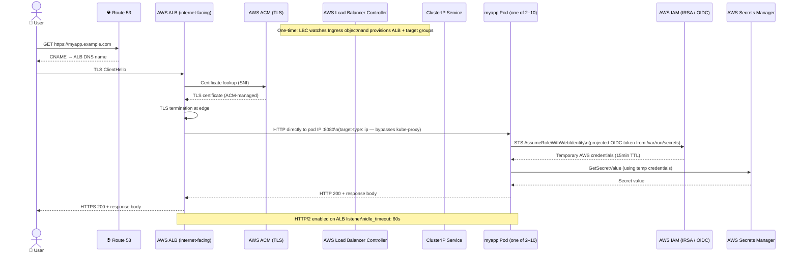
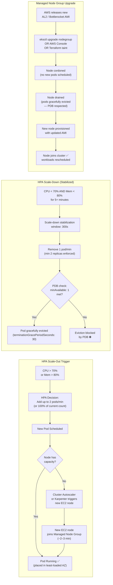
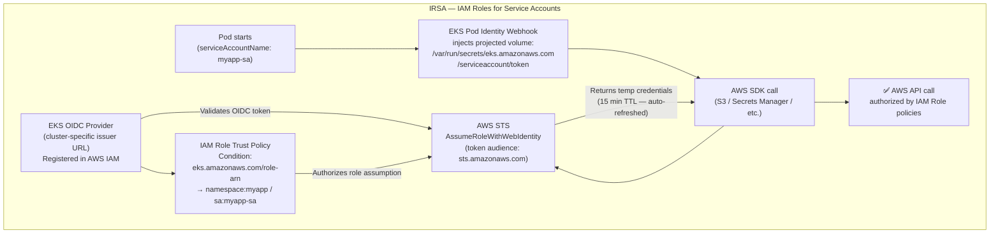
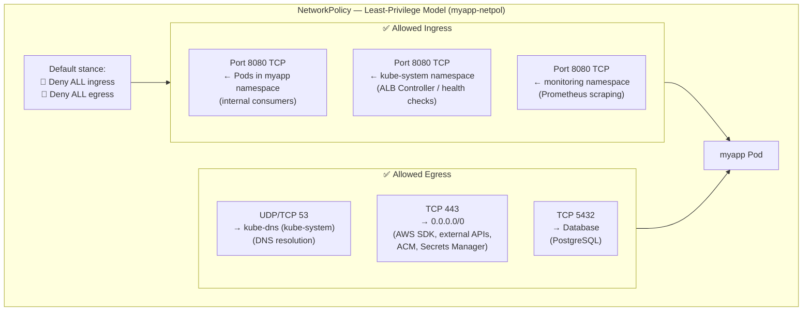

# MyApp — Amazon EKS · Architecture & Deployment Guide

> **Platform:** Amazon Elastic Kubernetes Service (EKS) — VPC-native  
> **Kubernetes version:** 1.28+  
> **Region:** `us-east-1` (N. Virginia) — Multi-AZ deployment across 3 Availability Zones

---

## Architecture Diagram

```mermaid
flowchart TB
    subgraph Internet["🌐 Internet / External Users"]
        User(["👤 User / Browser"])
        DevOps(["🧑‍💻 DevOps / kubectl CLI"])
    end

    subgraph AWS["☁️ AWS Account"]
        direction TB

        subgraph IAM["🔐 AWS IAM"]
            IRSARole["IAM Role: myapp-eks-irsa-role\n(IRSA — OIDC-federated)\nTrusted by myapp-sa\nin myapp namespace"]
            NodeRole["EC2 Node IAM Role\n(AmazonEKSWorkerNodePolicy\n+ AmazonEKS_CNI_Policy\n+ ECRReadOnly)"]
        end

        ECR["🗃️ Amazon ECR\n123456789012.dkr.ecr\n.us-east-1.amazonaws.com\n/myapp:1.0.0"]
        ACM["🔑 AWS Certificate Manager\n(TLS cert — myapp.example.com)\nARN injected into Ingress annotation"]
        SecretsManager["🔒 AWS Secrets Manager\n(recommended for prod)\nExternal Secrets Operator sync"]
        CW["📊 Amazon CloudWatch\nContainer Insights\n(metrics + logs — optional)"]
        Route53["🌐 Amazon Route 53\nmyapp.example.com → ALB DNS"]

        subgraph VPC["🏗️ AWS VPC — us-east-1 (10.0.0.0/16)"]
            direction TB

            subgraph PublicSubnets["Public Subnets (ALB)"]
                PSN1["pub-subnet-us-east-1a\n10.0.1.0/24\nTag: kubernetes.io/role/elb=1"]
                PSN2["pub-subnet-us-east-1b\n10.0.2.0/24"]
                PSN3["pub-subnet-us-east-1c\n10.0.3.0/24"]
            end

            subgraph PrivateSubnets["Private Subnets (Worker Nodes)"]
                SN1["priv-subnet-us-east-1a\n10.0.11.0/24\nTag: kubernetes.io/role/internal-elb=1"]
                SN2["priv-subnet-us-east-1b\n10.0.12.0/24"]
                SN3["priv-subnet-us-east-1c\n10.0.13.0/24"]
            end

            NAT["🌐 NAT Gateway\n(outbound internet from private subnets)"]

            subgraph ALB_Layer["⚖️ AWS Application Load Balancer"]
                ALBNode["ALB — internet-facing\nmyapp.example.com\nTLS termination via ACM\ntarget-type: ip (direct pod routing)"]
            end

            subgraph EKS_Cluster["☸️ EKS Cluster — myapp-cluster"]
                direction TB

                ControlPlane["🏛️ AWS-Managed Control Plane\n(API Server, etcd, Scheduler,\nController Manager)\n[Multi-AZ HA — AWS operated\nno master nodes visible to user]"]

                LBC["⚙️ AWS Load Balancer Controller\n(kube-system)\nWatches Ingress objects\n→ provisions ALB resources"]

                subgraph AZ1["Managed Node Group — us-east-1a"]
                    W1["🖥️ Worker Node 1\nt3.medium / m5.large\n(Amazon Linux 2 / Bottlerocket)"]
                    P1["📦 myapp Pod\nUID: 1000\nseccomp: RuntimeDefault\nreadOnlyRootFilesystem"]
                end

                subgraph AZ2["Managed Node Group — us-east-1b"]
                    W2["🖥️ Worker Node 2\nt3.medium / m5.large"]
                    P2["📦 myapp Pod\nUID: 1000"]
                end

                subgraph AZ3["Managed Node Group — us-east-1c"]
                    W3["🖥️ Worker Node 3\nt3.medium / m5.large"]
                    P3["📦 myapp Pod\nUID: 1000"]
                end

                SVC["⚙️ ClusterIP Service\nmyapp-svc:80 → pod:8080"]
                HPA["📈 HPA\nmin:2 / max:10\nCPU 70% | Mem 80%"]
                PDB["🛡️ PodDisruptionBudget\nminAvailable: 1"]
                CA["🔄 Cluster Autoscaler\nor Karpenter\n(provisions new nodes)"]
                NetPol["🔒 NetworkPolicy\nmyapp-netpol\n(deny-all + selective allow)"]
            end
        end
    end

    %% External traffic flow
    User -->|"HTTPS :443\nmyapp.example.com"| Route53
    Route53 -->|"Resolves to ALB DNS\n(CNAME / A record)"| ALBNode
    ALBNode -->|"TLS termination (ACM)\nHTTP direct to pod IPs\n(target-type: ip)"| P1
    ALBNode --> P2
    ALBNode --> P3

    %% DevOps
    DevOps -->|"kubectl / aws eks\nupdate-kubeconfig"| ControlPlane
    DevOps -->|"docker push / aws ecr\nget-login-password"| ECR

    %% LBC watches ingress
    ControlPlane -->|"Ingress object created"| LBC
    LBC -->|"Provisions / configures ALB"| ALBNode

    %% Image pull
    P1 & P2 & P3 -->|"imagePull\n(Node IAM Role — ECRReadOnly)"| ECR

    %% IRSA — AWS SDK calls
    P1 & P2 & P3 -->|"IRSA token (OIDC)\n→ AWS SDK calls"| IRSARole
    IRSARole -.->|"Grants access to"| SecretsManager

    %% Egress
    P1 & P2 & P3 -->|"Via NAT Gateway\n(internet egress)"| NAT
    NAT --> Internet

    %% Observability (optional)
    P1 & P2 & P3 -.->|"Fluent Bit DaemonSet\nor CloudWatch agent"| CW

    %% Autoscaling
    HPA -->|"scales replicas"| P1 & P2 & P3
    CA -->|"provisions new\nworker nodes"| W1

    %% Subnet placement
    W1 --- SN1
    W2 --- SN2
    W3 --- SN3
    ALBNode --- PSN1 & PSN2 & PSN3

    %% IAM
    W1 & W2 & W3 --- NodeRole

    %% NetworkPolicy scope
    NetPol -.->|"Enforced by VPC CNI\nor Calico"| P1 & P2 & P3

    %% Styling
    classDef awsOrange fill:#ff9900,color:#1a1a1a,stroke:#e68a00
    classDef pod fill:#1168bd,color:#fff,stroke:#0d52a0
    classDef service fill:#27ae60,color:#fff,stroke:#1e8449
    classDef managed fill:#232f3e,color:#fff,stroke:#232f3e
    classDef security fill:#c0392b,color:#fff,stroke:#a93226
    classDef subnet fill:#f0f4ff,stroke:#0f3460,stroke-width:1px

    class ControlPlane,LBC managed
    class P1,P2,P3 pod
    class SVC,ALBNode service
    class ECR,ACM,SecretsManager,CW,Route53 awsOrange
    class IRSARole,NodeRole,NetPol,PDB security
    class HPA,CA service
```



---

## Request Flow (Step-by-Step)



---

## Scaling & Node Lifecycle Flow



---

## IRSA Authentication Flow



---

## Network Security Model



---

## File Inventory

| File | Kind | API Version | Purpose |
|------|------|-------------|---------|
| [`myapp-namespace.yaml`](myapp-namespace.yaml) | `Namespace` | `v1` | Dedicated `myapp` namespace with cost-allocation and environment labels |
| [`myapp-serviceaccount.yaml`](myapp-serviceaccount.yaml) | `ServiceAccount` | `v1` | App identity with IRSA annotation (`eks.amazonaws.com/role-arn`) for AWS API access |
| [`myapp-configmap.yaml`](myapp-configmap.yaml) | `ConfigMap` | `v1` | Non-sensitive app config: port, log level, feature flags, CORS origins |
| [`myapp-secret.yaml`](myapp-secret.yaml) | `Secret` (Opaque) | `v1` | Placeholder base64 credentials — replace with Secrets Manager + ESO in production |
| [`myapp-networkpolicy.yaml`](myapp-networkpolicy.yaml) | `NetworkPolicy` | `networking.k8s.io/v1` | Deny-all baseline with selective allow rules for ingress (ALB, monitoring) and egress (DNS, HTTPS, DB) |
| [`myapp-deployment.yaml`](myapp-deployment.yaml) | `Deployment` | `apps/v1` | 2-replica app with multi-AZ spread, IRSA SA, init container, probes, read-only FS |
| [`myapp-service.yaml`](myapp-service.yaml) | `Service` (ClusterIP) | `v1` | Internal cluster routing — port 80 → pod port 8080 |
| [`myapp-ingress.yaml`](myapp-ingress.yaml) | `Ingress` | `networking.k8s.io/v1` | ALB Controller — internet-facing, ACM TLS, `target-type: ip`, HTTP→HTTPS redirect |
| [`myapp-hpa.yaml`](myapp-hpa.yaml) | `HorizontalPodAutoscaler` | `autoscaling/v2` | CPU 70% + memory 80% triggers, min 2 / max 10, 5-min scale-down stabilization |
| [`myapp-pdb.yaml`](myapp-pdb.yaml) | `PodDisruptionBudget` | `policy/v1` | `minAvailable: 1` — guarantees availability during node drains and upgrades |
| [`kustomization.yaml`](kustomization.yaml) | `Kustomization` | `kustomize.config.k8s.io/v1beta1` | Unified deploy entrypoint — `kubectl apply -k .` |

---

## Quick-Start Deployment

```bash
# ── Prerequisites ──────────────────────────────────────────────────────────────
# 1. AWS CLI configured:     aws configure
# 2. kubectl installed
# 3. eksctl or Terraform EKS cluster already running
# 4. AWS Load Balancer Controller installed in kube-system
#    (see: https://kubernetes-sigs.github.io/aws-load-balancer-controller/)
# 5. Metrics Server installed (required for HPA):
#    kubectl apply -f https://github.com/kubernetes-sigs/metrics-server/releases/latest/download/components.yaml
# 6. VPC CNI + NetworkPolicy support enabled (or Calico installed)

# ── 1. Authenticate kubectl ───────────────────────────────────────────────────
aws eks update-kubeconfig --name <CLUSTER_NAME> --region us-east-1

# ── 2. Push image to ECR ──────────────────────────────────────────────────────
aws ecr get-login-password --region us-east-1 \
  | docker login --username AWS \
    --password-stdin 123456789012.dkr.ecr.us-east-1.amazonaws.com

docker build -t myapp:1.0.0 .
docker tag myapp:1.0.0 123456789012.dkr.ecr.us-east-1.amazonaws.com/myapp:1.0.0
docker push 123456789012.dkr.ecr.us-east-1.amazonaws.com/myapp:1.0.0

# ── 3. Update placeholders in the YAML files ─────────────────────────────────
#  myapp-ingress.yaml:       replace ACM certificate ARN
#                            replace myapp.example.com with your domain
#  myapp-serviceaccount.yaml: replace IRSA IAM Role ARN
#  myapp-secret.yaml:        replace base64 placeholder values
#  myapp-deployment.yaml:    replace image: myapp:latest with ECR URI

# ── 4. Apply the full stack ───────────────────────────────────────────────────
kubectl apply -k myapp-deployments/eks-amazon/

# ── 5. Monitor rollout ────────────────────────────────────────────────────────
kubectl rollout status deployment/myapp -n myapp
kubectl get pods -n myapp -o wide

# ── 6. Retrieve the ALB DNS name ─────────────────────────────────────────────
kubectl get ingress myapp-ingress -n myapp
# Create a Route 53 CNAME pointing myapp.example.com → ALB DNS name

# ── 7. Verify HPA is active ───────────────────────────────────────────────────
kubectl get hpa myapp-hpa -n myapp

# ── 8. Check IRSA token projection ───────────────────────────────────────────
kubectl exec -n myapp deploy/myapp -- \
  ls /var/run/secrets/eks.amazonaws.com/serviceaccount/
```

---

## Platform-Specific Notes

| Feature | EKS Behaviour |
|---------|--------------|
| **Control Plane** | AWS-managed, multi-AZ, HA — no control plane nodes visible or accessible to the user |
| **Node OS** | Amazon Linux 2 (AL2), Amazon Linux 2023, or Bottlerocket (hardened, immutable OS) |
| **Container Runtime** | `containerd` 1.7+ on AL2/AL2023; `containerd` on Bottlerocket |
| **Ingress** | AWS Load Balancer Controller required — provisions a real AWS ALB per Ingress object |
| **TLS** | Terminated at the ALB via ACM — no cert-manager needed; ACM auto-renews certificates |
| **ALB Target Type** | `target-type: ip` routes the ALB directly to pod IPs, bypassing kube-proxy NodePort |
| **Image Pull** | ECR pull is authorized via the EC2 Node IAM Role (`AmazonEC2ContainerRegistryReadOnly`) — no imagePullSecret needed for same-account ECR |
| **IAM Integration** | IRSA (IAM Roles for Service Accounts) — OIDC-federated, short-lived tokens, no static keys |
| **Networking** | AWS VPC CNI — each pod gets a real VPC IP from the node's subnet CIDR |
| **NetworkPolicy** | Requires VPC CNI Network Policy Controller (`--enable-network-policy`) or Calico |
| **Cluster Autoscaler** | Cluster Autoscaler (CA) or Karpenter — scales EC2 nodes on pending pod pressure |
| **Managed Node Groups** | AWS manages OS patching, AMI rotation, and node replacement via the MNG API |
| **Node Upgrades** | `eksctl upgrade nodegroup` or console — cordon → drain (PDB respected) → replace |
| **Observability** | CloudWatch Container Insights (Fluent Bit DaemonSet); or third-party (Datadog, Prometheus) |
| **Secrets Management** | Use AWS Secrets Manager + External Secrets Operator (ESO) or Secrets Store CSI Driver |
| **etcd Encryption** | Enable via EKS Console or `aws eks update-cluster-config --encryption-config` (KMS key) |
| **Pod Security** | Kubernetes Pod Security Admission (PSA) — `restricted` profile enforced via namespace label |

---

## What You Must Adapt Before Production Use

| Item | Action Required |
|------|----------------|
| `image` in `myapp-deployment.yaml` | Replace `myapp:latest` with the full ECR URI (`123456789012.dkr.ecr.us-east-1.amazonaws.com/myapp:1.0.0`) |
| `certificate-arn` in `myapp-ingress.yaml` | Replace with the actual ACM certificate ARN for your domain |
| `host` in `myapp-ingress.yaml` | Replace `myapp.example.com` with your real DNS name |
| `eks.amazonaws.com/role-arn` in `myapp-serviceaccount.yaml` | Replace with the actual IAM Role ARN provisioned by your platform team |
| `myapp-secret.yaml` values | Replace all base64 placeholders — use AWS Secrets Manager + External Secrets Operator |
| NetworkPolicy enforcement | Enable VPC CNI Network Policy Controller (`aws eks update-addon --addon-name vpc-cni`) or install Calico |
| etcd encryption at rest | Enable KMS envelope encryption on the EKS cluster for Secret resources |
| Subnet tags | Tag public subnets `kubernetes.io/role/elb=1` and private subnets `kubernetes.io/role/internal-elb=1` |
| Cluster tag | Tag VPC subnets with `kubernetes.io/cluster/<CLUSTER_NAME>=owned` for ALB subnet auto-discovery |
| Metrics Server | Install before HPA is effective: `kubectl apply -f https://github.com/kubernetes-sigs/metrics-server/releases/latest/download/components.yaml` |
| AWS Load Balancer Controller | Install via Helm in `kube-system` — required for the Ingress to provision an ALB |
| IRSA OIDC provider | Associate an OIDC provider with the cluster: `eksctl utils associate-iam-oidc-provider --cluster <NAME> --approve` |
