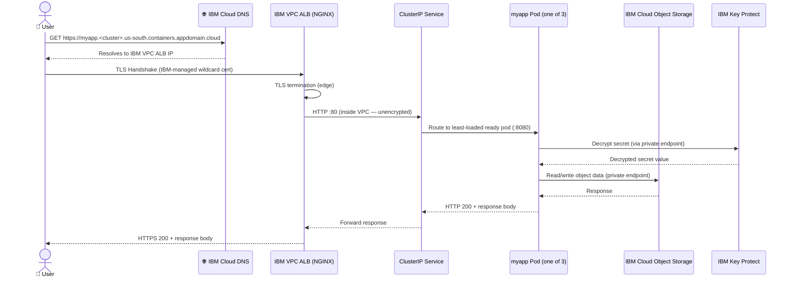
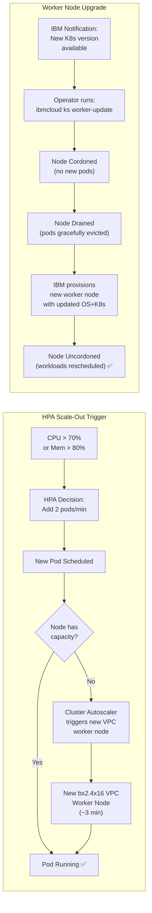

# MyApp — IKS on IBM Cloud VPC · Architecture & Deployment Guide

> **Platform:** IBM Kubernetes Service (IKS) — VPC Gen2 Infrastructure  
> **Kubernetes version:** 1.29+  
> **Region:** `us-south` (Dallas) — Multi-Zone Region (MZR)

---

## Architecture Diagram

```mermaid
flowchart TB
    subgraph Internet["🌐 Internet / External Users"]
        User(["👤 User / Browser"])
        DevOps(["🧑‍💻 DevOps / kubectl CLI"])
    end

    subgraph IBMCloud["☁️ IBM Cloud Account"]
        direction TB

        subgraph IAM["🔐 IBM Cloud IAM"]
            IAMPolicy["Access Policies\n(Users, ServiceIDs,\nTrusted Profiles)"]
        end

        ICR["🗃️ IBM Container Registry\nus.icr.io/myapp-namespace/myapp:1.0.0\n(Vulnerability Advisor scanning)"]
        KeyProtect["🔑 IBM Key Protect\n(etcd encryption, secret keys)"]
        COS["🪣 IBM Cloud Object Storage\n(private endpoint)"]
        LogAnalysis["📋 IBM Log Analysis\n(LogDNA — platform + app logs)"]
        Monitoring["📊 IBM Cloud Monitoring\n(Sysdig — metrics & dashboards)"]

        subgraph VPC["🏗️ IBM Cloud VPC — us-south"]
            direction TB

            subgraph Subnets["VPC Subnets (3 Availability Zones)"]
                SN1["Subnet us-south-1\n10.240.0.0/24"]
                SN2["Subnet us-south-2\n10.240.64.0/24"]
                SN3["Subnet us-south-3\n10.240.128.0/24"]
            end

            NAT["🌐 VPC NAT Gateway\n(outbound internet egress)"]

            subgraph IKS_Cluster["☸️ IKS Cluster — myapp-cluster"]
                direction TB

                ControlPlane["🏛️ IBM-Managed Control Plane\n(API Server, etcd, Scheduler,\nController Manager)\n[Multi-zone HA — IBM operated]"]

                subgraph ALB["IBM VPC ALB — Ingress (public)"]
                    ALBNode["NGINX-based IBM ALB\n*.us-south.containers.appdomain.cloud\nWildcard TLS (IBM Certificate Manager)"]
                end

                subgraph Zone1["Worker Pool — us-south-1"]
                    W1["🖥️ Worker Node 1\nbx2.4x16"]
                    P1["📦 myapp Pod\nUID: auto"]
                end

                subgraph Zone2["Worker Pool — us-south-2"]
                    W2["🖥️ Worker Node 2\nbx2.4x16"]
                    P2["📦 myapp Pod\nUID: auto"]
                end

                subgraph Zone3["Worker Pool — us-south-3"]
                    W3["🖥️ Worker Node 3\nbx2.4x16"]
                    P3["📦 myapp Pod\nUID: auto"]
                end

                SVC["⚙️ ClusterIP Service\nmyapp-svc:80 → 8080"]
                PVC["💾 PVC — ibmc-vpc-block-10iops-tier\n20Gi (RWO)"]
                HPA["📈 HPA\nmin:3 / max:10\nCPU 70% | Mem 80%"]
                CA["🔄 Cluster Autoscaler\n(IBM-managed add-on)"]
            end
        end
    end

    %% External traffic flow
    User -->|"HTTPS :443\nmyapp.<cluster>.us-south\n.containers.appdomain.cloud"| ALBNode
    ALBNode -->|"HTTP :80 (ClusterIP)"| SVC
    SVC --> P1
    SVC --> P2
    SVC --> P3

    %% DevOps access
    DevOps -->|"kubectl / ibmcloud ks CLI\n(IAM authenticated)"| ControlPlane
    DevOps -->|"ibmcloud cr push"| ICR

    %% Image pull
    P1 & P2 & P3 -->|"imagePull\n(all-icr-io auto-secret)"| ICR

    %% Egress
    P1 & P2 & P3 -->|"Private service\nendpoint"| COS
    P1 & P2 & P3 -->|"Private service\nendpoint"| KeyProtect
    P1 & P2 & P3 -->|"Via NAT Gateway\n(public internet)"| NAT

    %% Observability
    P1 & P2 & P3 -->|"Sysdig DaemonSet\nmetrics"| Monitoring
    P1 & P2 & P3 -->|"LogDNA DaemonSet\nlogs"| LogAnalysis
    ControlPlane -->|"Audit logs"| LogAnalysis

    %% Storage
    P1 -->|"RWO mount"| PVC

    %% Autoscaling
    HPA -->|"scales"| P1
    HPA -->|"scales"| P2
    HPA -->|"scales"| P3
    CA -->|"provisions new\nworker nodes"| W1

    %% IAM
    IAMPolicy --> ControlPlane

    %% Subnet placement
    W1 --- SN1
    W2 --- SN2
    W3 --- SN3

    %% Styling
    classDef ibmBlue fill:#0f3460,color:#fff,stroke:#0f3460
    classDef pod fill:#1e6fa8,color:#fff,stroke:#1e6fa8
    classDef service fill:#2d9cdb,color:#fff,stroke:#2d9cdb
    classDef storage fill:#27ae60,color:#fff,stroke:#27ae60
    classDef managed fill:#6c3483,color:#fff,stroke:#6c3483
    classDef vpc fill:#f0f4ff,stroke:#0f3460,stroke-width:2px

    class ControlPlane,ALBNode managed
    class P1,P2,P3 pod
    class SVC service
    class PVC,COS,ICR storage
    class KeyProtect,IAMPolicy ibmBlue
    class HPA,CA,Monitoring,LogAnalysis service
```



---

## Request Flow (Step-by-Step)



---

## Scaling & Upgrade Flow



---

## File Inventory

| File | Kind | Purpose |
|------|------|---------|
| [`namespace.yaml`](namespace.yaml) | Namespace | Creates `myapp` namespace with IBM Cloud labels |
| [`serviceaccount.yaml`](serviceaccount.yaml) | ServiceAccount | App identity with optional IBM Cloud IAM binding |
| [`configmap.yaml`](configmap.yaml) | ConfigMap | Non-sensitive app and IBM Cloud config |
| [`secret.yaml`](secret.yaml) | Secret | Sensitive credentials (use Key Protect in prod) |
| [`pvc.yaml`](pvc.yaml) | PersistentVolumeClaim | 20Gi IBM Cloud VPC Block Storage (10 IOPS/GB) |
| [`deployment.yaml`](deployment.yaml) | Deployment | 3-replica app with VPC zone spread, ICR image |
| [`service.yaml`](service.yaml) | Service (ClusterIP) | Internal routing to app pods |
| [`ingress.yaml`](ingress.yaml) | Ingress | IBM ALB — TLS, IBM subdomain, NGINX annotations |
| [`hpa.yaml`](hpa.yaml) | HorizontalPodAutoscaler | CPU/memory-based autoscaling (3–10 replicas) |
| [`kustomization.yaml`](kustomization.yaml) | Kustomization | `kubectl apply -k .` entrypoint |

---

## Quick-Start Deployment

```bash
# 1. Authenticate to IBM Cloud and set the cluster context
ibmcloud login --sso
ibmcloud ks cluster config --cluster <CLUSTER_NAME>

# 2. Push your image to IBM Container Registry
ibmcloud cr login
docker build -t us.icr.io/myapp-namespace/myapp:1.0.0 .
docker push us.icr.io/myapp-namespace/myapp:1.0.0

# 3. Update placeholder values in the YAML files
#    - Replace <CLUSTER_NAME> in ingress.yaml
#    - Update base64 values in secret.yaml

# 4. Apply the full stack
kubectl apply -k .

# 5. Monitor rollout
kubectl rollout status deployment/myapp -n myapp
kubectl get pods -n myapp -o wide

# 6. Get the Ingress URL
kubectl get ingress myapp-ingress -n myapp
```

---

## Platform-Specific Notes

| Feature | IKS Behaviour |
|---------|--------------|
| Control Plane | IBM-managed, HA, zero operator action |
| Image Pull Secret | `all-icr-io` auto-injected into every namespace |
| TLS Certificate | IBM Certificate Manager — auto-renewed wildcard cert |
| Block Storage | `ibmc-vpc-block-10iops-tier` — provisioned in < 60s |
| Cluster Autoscaler | IBM add-on — enable with `ibmcloud ks cluster addon enable cluster-autoscaler` |
| Worker Upgrades | `ibmcloud ks worker-update` — rolling, zero-downtime |
| Private Endpoints | All IBM services reachable without leaving VPC network |
| Egress | VPC NAT Gateway for internet; private endpoints for IBM services |
