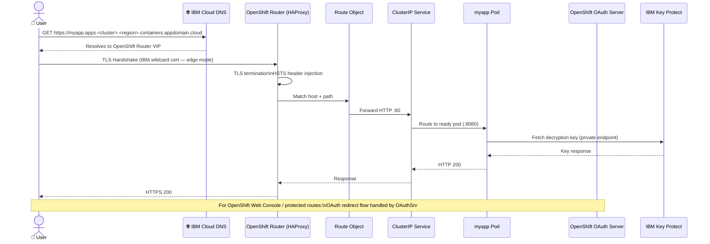
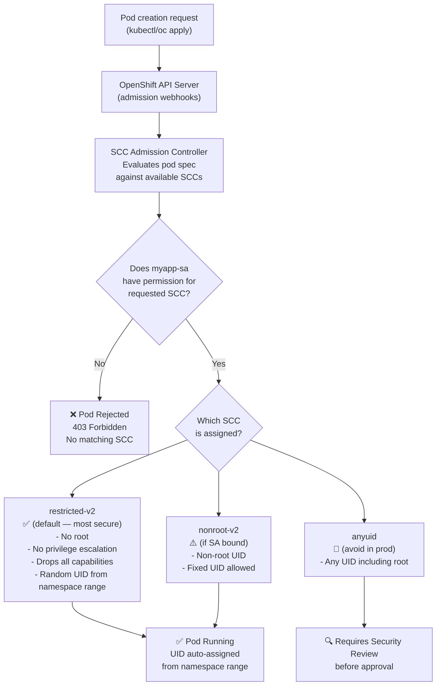
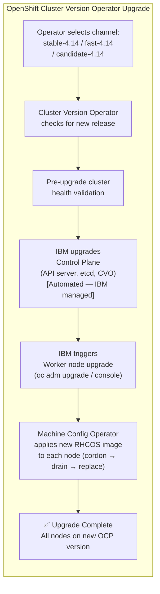

# MyApp — ROKS (Red Hat OpenShift on IBM Cloud) · Architecture & Deployment Guide

> **Platform:** Red Hat OpenShift on IBM Cloud (ROKS) — VPC Gen2 Infrastructure  
> **OpenShift version:** 4.14+  
> **Region:** `us-south` (Dallas) — Multi-Zone Region (MZR)

---

## Architecture Diagram

```mermaid
flowchart TB
    subgraph Internet["🌐 Internet / External Users"]
        User(["👤 User / Browser"])
        DevOps(["🧑‍💻 DevOps / oc CLI"])
    end

    subgraph IBMCloud["☁️ IBM Cloud Account"]
        direction TB

        subgraph IAM["🔐 IBM Cloud IAM + Red Hat SSO"]
            IAMPolicy["IBM Cloud IAM Policies\n+ OpenShift OAuth Server\n(LDAP / IBMid integration)"]
        end

        ICR["🗃️ IBM Container Registry\nus.icr.io/myapp-namespace/myapp:1.0.0\n+ Red Hat Quay.io / OperatorHub"]
        KeyProtect["🔑 IBM Key Protect\n(etcd encryption at rest)"]
        COS["🪣 IBM Cloud Object Storage\n(private endpoint)"]
        LogAnalysis["📋 IBM Log Analysis\n(LogDNA — optional IBM-native)"]
        Monitoring["📊 IBM Cloud Monitoring\n(Sysdig — optional IBM-native)"]

        subgraph VPC["🏗️ IBM Cloud VPC — us-south"]
            direction TB

            subgraph Subnets["VPC Subnets (3 Availability Zones)"]
                SN1["Subnet us-south-1"]
                SN2["Subnet us-south-2"]
                SN3["Subnet us-south-3"]
            end

            NAT["🌐 VPC NAT Gateway\n(outbound internet egress)"]

            subgraph ROKS_Cluster["☸️ ROKS Cluster — OpenShift 4.14"]
                direction TB

                ControlPlane["🏛️ IBM-Managed OpenShift Control Plane\n(API Server, etcd, Scheduler, CVO,\nMachine Config Operator)\n[Multi-zone HA — IBM operated]"]

                subgraph Router["OpenShift Router (HAProxy)"]
                    RouterPod["HAProxy Router\n*.apps.<CLUSTER>.<REGION>\n.containers.appdomain.cloud\nWildcard TLS (IBM-managed)"]
                end

                subgraph BuiltinStack["Built-in OpenShift Operators"]
                    PromStack["📊 Prometheus + Alertmanager\n+ Grafana\n(cluster-monitoring-operator)"]
                    OCPLogging["📋 OpenShift Logging\n(Fluentd/Vector → Loki/ES)"]
                    ODF["💾 OpenShift Data Foundation\n(Ceph block + file + object)\n[optional add-on]"]
                    OAuthSrv["🔐 OpenShift OAuth Server"]
                    ImageReg["🗃️ Internal Image Registry\nimage-registry.openshift-image-registry.svc:5000"]
                end

                subgraph Zone1["Worker Pool — us-south-1 (MachineSet)"]
                    W1["🖥️ Worker Node 1\nbx2.4x16"]
                    P1["📦 myapp Pod\n(SCC: restricted-v2)\nUID: namespace-assigned"]
                end

                subgraph Zone2["Worker Pool — us-south-2 (MachineSet)"]
                    W2["🖥️ Worker Node 2\nbx2.4x16"]
                    P2["📦 myapp Pod\n(SCC: restricted-v2)"]
                end

                subgraph Zone3["Worker Pool — us-south-3 (MachineSet)"]
                    W3["🖥️ Worker Node 3\nbx2.4x16"]
                    P3["📦 myapp Pod\n(SCC: restricted-v2)"]
                end

                SVC["⚙️ ClusterIP Service\nmyapp-svc:80 → 8080"]
                Route["🔀 OpenShift Route\nmyapp.apps.<CLUSTER>.<REGION>...\nTLS: edge / Redirect HTTP→HTTPS"]
                PVC["💾 PVC — ibmc-vpc-block-10iops-tier\n20Gi (RWO)\nOR ocs-storagecluster-ceph-rbd"]
                HPA["📈 HPA\nmin:3 / max:10"]
                MachineAuto["🔄 MachineAutoscaler\n(MachineSet-based\ncluster autoscaling)"]
            end
        end
    end

    %% External traffic
    User -->|"HTTPS :443\nmyapp.apps.<cluster>.<region>\n.containers.appdomain.cloud"| RouterPod
    RouterPod -->|"TLS termination (edge)\nHTTP :80 ClusterIP"| Route
    Route --> SVC
    SVC --> P1 & P2 & P3

    %% DevOps
    DevOps -->|"oc / kubectl CLI\n(IBM IAM + OpenShift OAuth)"| ControlPlane
    DevOps -->|"ibmcloud cr push / podman push"| ICR

    %% Image pulls
    P1 & P2 & P3 -->|"imagePull\n(auto-injected pull secret)"| ICR
    P1 & P2 & P3 -.->|"OpenShift S2I builds\n(optional)"| ImageReg

    %% Egress
    P1 & P2 & P3 -->|"Private endpoint"| COS
    P1 & P2 & P3 -->|"Private endpoint"| KeyProtect
    P1 & P2 & P3 -->|"Via NAT\n(internet)"| NAT

    %% Built-in observability
    P1 & P2 & P3 -->|"User-workload\nmetrics (UWM)"| PromStack
    P1 & P2 & P3 -->|"App logs"| OCPLogging
    PromStack -.->|"Optional forward\nto IBM Monitoring"| Monitoring
    OCPLogging -.->|"Optional forward\nto IBM Log Analysis"| LogAnalysis

    %% Storage
    P1 -->|"RWO mount"| PVC
    ODF -.->|"Provides StorageClass\nocs-storagecluster-*"| PVC

    %% Autoscaling
    HPA --> P1 & P2 & P3
    MachineAuto -->|"Creates new VMs\nvia MachineSet"| W1

    %% SCC enforcement
    ControlPlane -->|"SCC admission\ncontrol (restricted-v2)"| P1 & P2 & P3

    %% Subnet placement
    W1 --- SN1
    W2 --- SN2
    W3 --- SN3

    classDef redhat fill:#c0392b,color:#fff,stroke:#c0392b
    classDef pod fill:#e74c3c,color:#fff,stroke:#c0392b
    classDef service fill:#2d9cdb,color:#fff,stroke:#1a6fa8
    classDef storage fill:#27ae60,color:#fff,stroke:#1e8449
    classDef managed fill:#6c3483,color:#fff,stroke:#5b2c6f
    classDef builtin fill:#1a5276,color:#fff,stroke:#154360

    class ControlPlane,RouterPod managed
    class P1,P2,P3 pod
    class SVC,Route service
    class PVC,COS,ICR,ODF,ImageReg storage
    class KeyProtect,IAMPolicy,OAuthSrv redhat
    class PromStack,OCPLogging,HPA,MachineAuto builtin
```



---

## Request Flow (Step-by-Step)



---

## OpenShift-Specific Security Flow (SCC Enforcement)



---

## Upgrade Flow (OpenShift CVO Model)



---

## File Inventory

| File | Kind | Purpose |
|------|------|---------|
| [`namespace.yaml`](namespace.yaml) | Namespace / Project | Creates `myapp` namespace with OpenShift monitoring label |
| [`serviceaccount.yaml`](serviceaccount.yaml) | ServiceAccount + RoleBinding | SA bound to `restricted-v2` SCC |
| [`configmap.yaml`](configmap.yaml) | ConfigMap | App config with OpenShift-specific endpoints |
| [`secret.yaml`](secret.yaml) | Secret | Sensitive credentials (use ESO + IBM Secrets Manager in prod) |
| [`pvc.yaml`](pvc.yaml) | PersistentVolumeClaim | 20Gi VPC Block Storage or ODF (Ceph) |
| [`deployment.yaml`](deployment.yaml) | Deployment | Standard K8s Deployment (not DeploymentConfig) |
| [`service.yaml`](service.yaml) | Service (ClusterIP) | Internal routing |
| [`route.yaml`](route.yaml) | Route (OpenShift) | HAProxy Router — edge TLS, HSTS, sticky sessions |
| [`hpa.yaml`](hpa.yaml) | HorizontalPodAutoscaler | CPU/memory-based autoscaling |
| [`kustomization.yaml`](kustomization.yaml) | Kustomization | `oc apply -k .` entrypoint |

---

## Quick-Start Deployment

```bash
# 1. Authenticate to IBM Cloud and login to OpenShift
ibmcloud login --sso
ibmcloud oc cluster config --cluster <CLUSTER_NAME>
oc login --token=<TOKEN> --server=https://api.<CLUSTER_DOMAIN>:6443

# 2. Push image to IBM Container Registry
ibmcloud cr login
docker build -t us.icr.io/myapp-namespace/myapp:1.0.0 .
docker push us.icr.io/myapp-namespace/myapp:1.0.0

# 3. Update placeholders in YAML files
#    - Replace <CLUSTER_NAME> and <REGION> in route.yaml
#    - Replace <CLUSTER_DOMAIN> in configmap.yaml
#    - Update base64 values in secret.yaml

# 4. Apply the full stack
oc apply -k .

# 5. Watch rollout
oc rollout status deployment/myapp -n myapp
oc get pods -n myapp -o wide

# 6. Get the Route URL
oc get route myapp-route -n myapp

# 7. Check SCC assignment
oc get pod -n myapp -o jsonpath='{.items[*].metadata.annotations.openshift\.io/scc}'
```

---

## Platform-Specific Notes

| Feature | ROKS Behaviour |
|---------|---------------|
| Control Plane | IBM-managed OpenShift 4.x — CVO-driven upgrades |
| Ingress | OpenShift HAProxy Router (not NGINX Ingress) — use `Route` not `Ingress` |
| Pod Security | SCCs enforced — `restricted-v2` by default (stricter than upstream PSA) |
| Monitoring | Built-in Prometheus stack — no additional installation needed |
| Logging | OpenShift Logging Operator via OperatorHub |
| Storage | ODF (Ceph) available via OperatorHub — RWX support |
| Image Registry | Built-in registry at `image-registry.openshift-image-registry.svc:5000` |
| UID Assignment | OpenShift assigns UID from namespace range — do not hard-code |
| Autoscaling | MachineAutoscaler (CRD-based) — more native than IKS add-on approach |
| OCP License | Per-vCPU-hour Red Hat license included in IBM Cloud billing |
