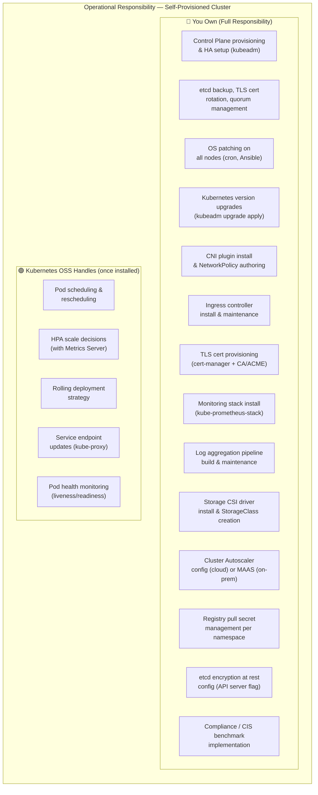
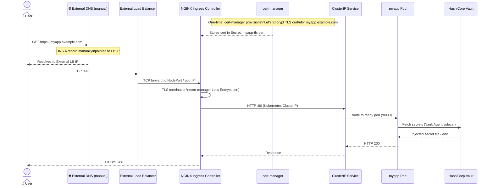

# MyApp — Self-Provisioned Kubernetes · Architecture & Deployment Guide

> **Platform:** Self-Provisioned Kubernetes (on-premises or bare cloud VMs)  
> **Kubernetes version:** 1.29+ (kubeadm or equivalent)  
> **Infrastructure:** Bare-metal, VMware, or cloud VMs without a managed Kubernetes service

---

## Architecture Diagram

```mermaid
flowchart TB
    subgraph Internet["🌐 Internet / External Users"]
        User(["👤 User / Browser"])
        DevOps(["🧑‍💻 DevOps / kubectl CLI"])
    end

    subgraph YourInfra["🏗️ Your Infrastructure (On-Prem / Bare Cloud VMs)"]
        direction TB

        subgraph ExternalSvcs["External Services (you manage)"]
            Registry["🗃️ Private Container Registry\nHarbor / Quay (self-hosted)\nor cloud registry (ICR, ECR, etc.)"]
            DNS_Ext["🌐 External DNS Provider\n(add A/CNAME records manually)"]
            LB_Ext["⚖️ External Load Balancer\n(HAProxy / MetalLB / F5)\nor cloud LB (if applicable)"]
            VaultSvc["🔑 HashiCorp Vault\nor Secrets Manager\n(you install & operate)"]
        end

        subgraph K8sCluster["☸️ Self-Provisioned Kubernetes Cluster"]
            direction TB

            subgraph ControlPlaneNodes["Control Plane Nodes (you operate — 3 for HA)"]
                CP1["🖥️ Control Plane Node 1\nkube-apiserver\netcd\nkube-scheduler\nkube-controller-manager"]
                CP2["🖥️ Control Plane Node 2\n(etcd member)"]
                CP3["🖥️ Control Plane Node 3\n(etcd member)"]
                etcd["🗄️ etcd cluster\n(3-node HA)\n⚠️ You manage backups,\nTLS rotation, upgrades"]
            end

            subgraph AddOns["Add-Ons (you install & maintain)"]
                CNI["🔌 CNI Plugin\nCalico / Cilium / Flannel\n(you choose & configure)"]
                IngressCtrl["🔀 NGINX Ingress Controller\n(you install & maintain)\nv1.10+ recommended"]
                CertMgr["🔐 cert-manager\n+ Let's Encrypt ClusterIssuer\n(you install & maintain)"]
                MetricsServer["📊 Metrics Server\n(required for HPA)\n(you install)"]
                PromStack["📊 kube-prometheus-stack\nPrometheus + Alertmanager\n+ Grafana\n(you install & maintain)"]
                Loki["📋 Loki + Promtail\nor Fluent Bit → Elasticsearch\n(log aggregation — you build)"]
                CSI["💾 CSI Driver\nRook-Ceph / Longhorn / NFS\n(you install & configure)"]
            end

            subgraph WorkerNodes["Worker Nodes (you provision & maintain)"]
                subgraph Node1["Worker Node 1"]
                    W1["🖥️ VM / Bare-metal\n(OS patching — you manage)"]
                    P1["📦 myapp Pod\nUID: 1001 (explicit)\nSCC: Pod Security Admission\n(restricted policy)"]
                end
                subgraph Node2["Worker Node 2"]
                    W2["🖥️ VM / Bare-metal"]
                    P2["📦 myapp Pod"]
                end
                subgraph Node3["Worker Node 3"]
                    W3["🖥️ VM / Bare-metal"]
                    P3["📦 myapp Pod"]
                end
            end

            SVC["⚙️ ClusterIP Service\nmyapp-svc:80 → 8080"]
            Ingress_K8s["🌐 Kubernetes Ingress\nmyapp.example.com\n(routed by NGINX controller)"]
            PVC["💾 PVC — local-path\nor rook-ceph-block\n20Gi (RWO)"]
            HPA["📈 HPA\nmin:2 / max:8\n(requires Metrics Server)"]
        end
    end

    %% External traffic flow
    User -->|"HTTPS :443\nmyapp.example.com"| LB_Ext
    LB_Ext -->|"TCP forward\nto Ingress NodePort\nor LoadBalancer IP"| IngressCtrl
    IngressCtrl -->|"TLS termination\n(cert-manager cert)\nHTTP :80"| Ingress_K8s
    Ingress_K8s --> SVC
    SVC --> P1 & P2 & P3

    %% DNS setup (manual)
    DevOps -->|"Manual: add A/CNAME\npointing to LB IP"| DNS_Ext
    DNS_Ext -.->|"Resolves\nmyapp.example.com"| User

    %% DevOps access
    DevOps -->|"kubectl (kubeconfig)\nor VPN tunnel"| CP1

    %% Image
    DevOps -->|"docker push /\npodman push"| Registry
    P1 & P2 & P3 -->|"imagePull\n(manual pull secret\nin each namespace)"| Registry

    %% Secrets
    P1 & P2 & P3 -->|"Vault Agent Injector\nor ESO sync"| VaultSvc

    %% TLS cert provisioning
    CertMgr -->|"ACME HTTP-01 challenge\nor DNS-01 challenge"| LB_Ext
    CertMgr -->|"Stores TLS cert\nin Secret: myapp-tls-cert"| Ingress_K8s

    %% Observability
    P1 & P2 & P3 -->|"Prometheus scrape\n/metrics :9090"| PromStack
    P1 & P2 & P3 -->|"Promtail/Fluent Bit\nlog collection"| Loki

    %% Storage
    P1 -->|"RWO PVC mount\n/app/data"| PVC
    CSI -->|"Provisions PV\nfor PVC"| PVC

    %% HPA
    HPA -->|"scales"| P1 & P2 & P3
    MetricsServer -->|"CPU/mem metrics\nfor HPA"| HPA

    %% CNI
    CNI -.->|"Enforces NetworkPolicy\npod-to-pod connectivity"| P1 & P2 & P3

    classDef selfManaged fill:#e67e22,color:#fff,stroke:#d35400
    classDef pod fill:#2980b9,color:#fff,stroke:#1a6fa8
    classDef service fill:#27ae60,color:#fff,stroke:#1e8449
    classDef addon fill:#8e44ad,color:#fff,stroke:#7d3c98
    classDef warning fill:#c0392b,color:#fff,stroke:#a93226
    classDef external fill:#95a5a6,color:#1a1a1a,stroke:#7f8c8d

    class CP1,CP2,CP3,etcd warning
    class P1,P2,P3 pod
    class SVC,Ingress_K8s service
    class CNI,IngressCtrl,CertMgr,MetricsServer,PromStack,Loki,CSI addon
    class Registry,DNS_Ext,LB_Ext,VaultSvc external
    class W1,W2,W3 selfManaged
```



---

## Operational Responsibility Matrix



---

## Request Flow (Step-by-Step)



---

## Cluster Bootstrap Flow (kubeadm)

```mermaid
flowchart TD
    subgraph Bootstrap["Cluster Bootstrap — Your Responsibility"]
        Infra["1️⃣ Provision VMs / Bare-metal\n(3 control plane + N workers)\nOS: Ubuntu 22.04 / RHEL 9"]
        --> OSPrep["2️⃣ OS Preparation\n- Disable swap\n- Load kernel modules\n- Set sysctl params\n- Install containerd / CRI-O"]
        --> KubeInstall["3️⃣ Install Kubernetes packages\nkubeadm, kubelet, kubectl"]
        --> KubeadmInit["4️⃣ kubeadm init\n--control-plane-endpoint <LB_IP>\n--upload-certs\n(first control plane node)"]
        --> JoinCP["5️⃣ Join remaining control\nplane nodes\n(kubeadm join --control-plane)"]
        --> CNIInstall["6️⃣ Install CNI Plugin\nkubectl apply -f calico.yaml\nOR cilium install"]
        --> JoinWorkers["7️⃣ Join worker nodes\n(kubeadm join)"]
        --> AddOnsInstall["8️⃣ Install Add-ons\n- Metrics Server\n- NGINX Ingress\n- cert-manager\n- Prometheus stack\n- CSI driver\n- Vault (optional)"]
        --> AppDeploy["9️⃣ Deploy MyApp\nkubectl apply -k ."]
        --> Done["✅ Cluster Ready"]
    end
```



---

## File Inventory

| File | Kind | Purpose |
|------|------|---------|
| [`namespace.yaml`](namespace.yaml) | Namespace | Creates `myapp` namespace with PSA `restricted` policy |
| [`serviceaccount.yaml`](serviceaccount.yaml) | ServiceAccount + RoleBinding | SA with view RBAC (no cloud IAM binding) |
| [`configmap.yaml`](configmap.yaml) | ConfigMap | Generic app config — adapt endpoints to your infra |
| [`secret.yaml`](secret.yaml) | Secret | Placeholder credentials — **must** use etcd encryption or Vault |
| [`pvc.yaml`](pvc.yaml) | PersistentVolumeClaim | 20Gi `local-path` (adapt to Rook-Ceph/Longhorn for prod) |
| [`deployment.yaml`](deployment.yaml) | Deployment | Non-root, read-only FS, PSA restricted compliant |
| [`service.yaml`](service.yaml) | Service (ClusterIP) | Internal routing — MetalLB optional for direct LB |
| [`ingress.yaml`](ingress.yaml) | Ingress (NGINX) | cert-manager TLS, NGINX annotations, `ingressClassName: nginx` |
| [`hpa.yaml`](hpa.yaml) | HorizontalPodAutoscaler | Requires Metrics Server pre-installed |
| [`kustomization.yaml`](kustomization.yaml) | Kustomization | `kubectl apply -k .` entrypoint |

---

## Quick-Start Deployment

```bash
# Prerequisites — must be installed first:
# 1. Kubernetes cluster (kubeadm, k3s, or equivalent)
# 2. NGINX Ingress Controller
# 3. cert-manager + ClusterIssuer
# 4. Metrics Server (for HPA)
# 5. CSI driver + StorageClass

# Verify prerequisites
kubectl get ingressclass
kubectl get storageclass
kubectl get pods -n cert-manager
kubectl top nodes  # Fails if Metrics Server is missing

# Update YAML files:
# - ingress.yaml: replace myapp.example.com with your domain
# - pvc.yaml: replace 'local-path' with your actual StorageClass
# - secret.yaml: replace base64 placeholders
# - deployment.yaml: replace myregistry.io/myapp:1.0.0 with your image

# Apply
kubectl apply -k .

# Watch rollout
kubectl rollout status deployment/myapp -n myapp
kubectl get pods -n myapp -o wide

# Check Ingress
kubectl get ingress -n myapp
kubectl describe ingress myapp-ingress -n myapp
```

---

## What You Must Adapt Before Production Use

| Item | Action Required |
|------|----------------|
| `storageClassName` in pvc.yaml | Replace `local-path` with a production-grade CSI class (Rook-Ceph, Longhorn) |
| `image` in deployment.yaml | Replace `myregistry.io/myapp:1.0.0` with your actual registry path |
| `host` in ingress.yaml | Replace `myapp.example.com` with your real domain |
| `secret.yaml` values | Replace base64 placeholders — implement Vault or Sealed Secrets |
| etcd encryption | Configure `--encryption-provider-config` on kube-apiserver |
| Control plane HA | Ensure 3 control-plane nodes + external etcd or stacked etcd |
| Cluster Autoscaler | Configure with your cloud/hypervisor credentials for node scaling |
| ImagePullSecret | Uncomment and configure if using a private registry |
| NetworkPolicy | Add Calico/Cilium NetworkPolicy resources to restrict inter-pod traffic |
| PodDisruptionBudget | Add PDB to prevent all pods from being evicted simultaneously |
